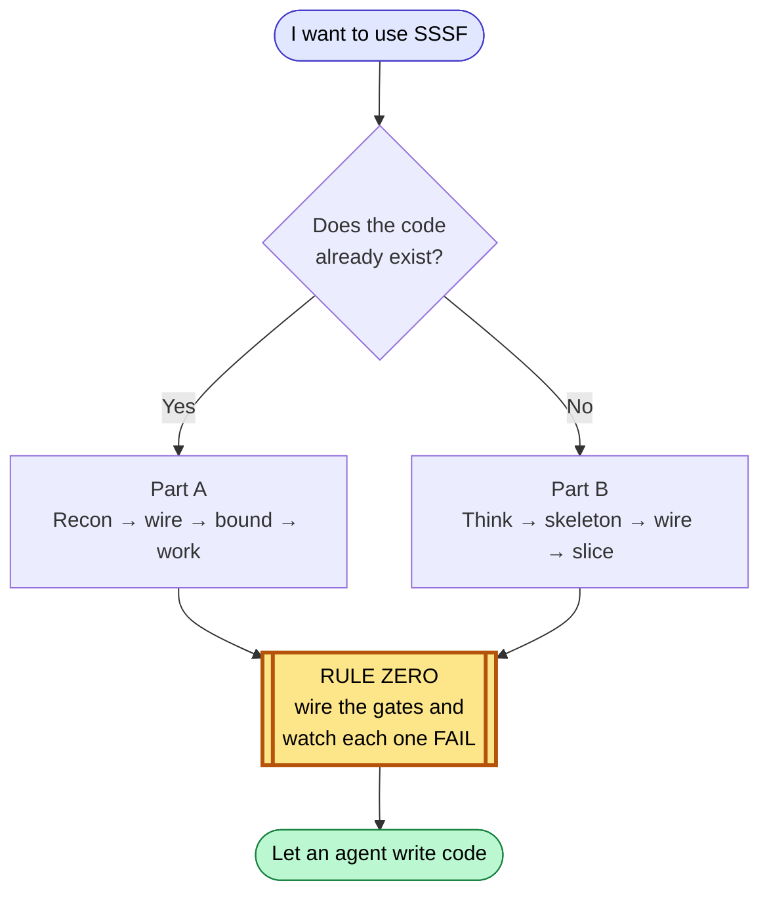
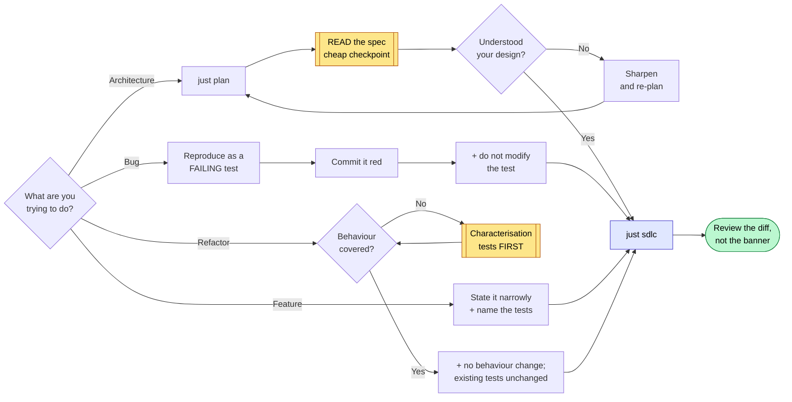
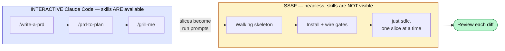
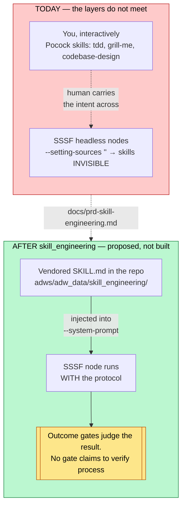

# Adoption playbook

Two situations: a codebase that already exists, and a project that does not yet.
Both start from the same non-negotiable rule.



---

## Rule zero: wire the gates before an agent writes a line

A freshly stamped factory ships every quality block as an `echo` that exits 0.
Run a workflow against it and you get a green trace that proves nothing — the
agent's claim went unchecked and the run *reported success*. This is worse than
having no factory, because it manufactures confidence.

So the first thing you do in any repo, before any agent writes anything:

```bash
just quality "baseline"        # free, zero agents — look at what it claims
```

If it says `PLACEHOLDER`, the gates are fake. Wire them in
`adws/adw_modules/quality.py`, then **prove each one can fail**:

```bash
# break exactly one thing, run the gates, confirm exactly one goes red, restore
```

A gate you have not watched fail is not a gate. Two separate times in this
repo a deliberately broken build stayed green — and both times the *test* was
the defect, not the tool. Budget an hour for this. It is the highest-value hour
in the whole adoption.


Rules for the commands themselves: `argv` is a **list**, never a shell string;
call binaries by bare name so they resolve in the operator's environment; and
put scope and strictness in your config files (`pyproject.toml`,
`package.json`) rather than in the argv, so the gate and a local run can never
disagree.

---

## Part A — an existing codebase

### A1. Recon before spending (cheap)

```bash
cd /path/to/your/repo
uv run /path/to/sssf/.claude/skills/sssf/scripts/install.py
git add -A && git commit -m "Install SSSF"     # keep the tree clean, see A3
just scout "map this codebase: entry points, layers, test setup, build commands"
```

`just scout` is read-only and costs cents. Its findings land in
`adws/adw_data/sessions/<adw_id>/context_handoff/scout_findings.md`. Read them.
You are checking whether the agent understood your repo before you let it
change anything.

### A2. Wire the gates (rule zero)

Point `test`, `lint` and `typecheck` at your real commands. Delete blocks you
do not have — a `build` block running `echo` is a phantom check, and
`run_quality()` will happily report it as passed.

If your suite is slow, scope the test gate to a fast subset now and widen later.
A gate nobody waits for gets disabled, and a disabled gate is a placeholder with
extra steps.

### A3. Set the boundaries

Two different mechanisms, and people conflate them:

- **`tools`** is a capability list — what the agent *can* do.
- **`writes`** is a boundary — what it *may change in the repo*, enforced after
  every call by diffing the tree.

For an existing codebase, tighten `writes` before your first build run.
Give the documenter `docs/` and `**/*.md`. Give the planner `specs/`. Leave the
builder unrestricted only if you are ready to review its whole diff.

`protected_files` is off-limits to everyone: keep `adws/adw_modules/`,
`adws/adw_sssf_config/` and `adws/adw_*.py` in it, so no agent can edit the
machinery that grades its own work. Add your CI config and any secrets path.

**Sharp edge:** the commit phase runs `git add -A` — it stages the *entire*
working tree. Start every run from a clean tree, or your unrelated work in
progress lands in the agent's commit.

### A4. The four jobs



**Improve architecture.** Do not hand this to a build workflow. Plan first,
read the plan, then decide:

```bash
just plan "extract the payment provider calls behind one interface; no behaviour change"
# read specs/<adw_id>_*.md yourself — this is the cheap checkpoint
just sdlc  "<same prompt, once the plan is right>"
```

`just plan` runs the planner alone. It is the single best value in the toolkit:
a few tens of cents to find out that the agent misunderstood your architecture,
instead of a few dollars *and* a bad diff.

**Find and fix bugs.** The fix loop is a repair machine, so give it something
red to repair. Reproduce the bug as a failing test first — by hand, or with a
cheap agent — commit it red, then:

```bash
just sdlc "make the failing test in tests/test_x.py pass; do not modify the test"
```

The `do not modify the test` clause matters: the builder has write access and
deleting an assertion is the cheapest path to green. In this repo it did not
take that path, but do not rely on virtue you have not constrained.

**Implement a feature.** The main line. Keep the request narrow enough that one
plan can express it:

```bash
just sdlc "add X; follow existing conventions; add tests covering A, B and C"
```

Expect roughly **$0.50–$1.50** for a small feature, most of it the planner.

**Refactor into reusable abstractions.** The most dangerous job, because
"working" and "unchanged" are different claims. Refactoring is only safe behind
tests that pin *current* behaviour, so:

1. Check coverage of the code you are about to move. If it is thin, spend a run
   adding characterisation tests **first**, and commit them.
2. Then refactor with an explicit no-behaviour-change constraint:

```bash
just sdlc "extract the discount rules behind one interface. No behaviour change: every existing test must pass unchanged. Do not modify or delete any existing test."
```

The green suite is your evidence the refactor was safe. Without it you are not
refactoring, you are rewriting and hoping.

### A5. Read what happened

```bash
just sessions            # last runs, cost, status
just phases <adw_id>     # which phase did what
```

Check cost per run early and often. If the planner is eating 70% of your spend
on straightforward work, move it to a cheaper model — measured here, a sonnet
planner cost 46% less than opus on the same task *and produced the better
design*. One sample, but it refutes "expensive model = better plan" as a default.

---

## Part B — a new project



### B1. Think before there is code (interactive, not SSSF)

SSSF is an execution engine. It is the wrong tool for deciding what to build.

Do this part **interactively** in Claude Code, where the Pocock skills are
actually available:

```
/write-a-prd     interview yourself into a spec
/prd-to-plan     break it into vertical slices
/grill-me        stress-test the plan before it costs anything
```

> **Why interactive:** SSSF agents run with `--setting-sources ''` and therefore
> **cannot see your installed skills**. Verified by probe: under that flag an
> agent sees only built-in skills. `docs/prd-skill-engineering.md` proposes
> fixing this by vendoring skill text into agent prompts — **that is a plan, not
> a shipped feature.** Until it exists, Pocock skills are for your interactive
> sessions and SSSF is for the repeatable loop. Do not expect an SSSF agent to
> honour `/tdd` just because the skill is installed on your machine.

### B2. Make it a repo with a walking skeleton

```bash
mkdir project && cd project && git init
```

Before installing SSSF, build the thinnest thing that runs and is tested — by
hand or in one interactive session:

- one real module with one real function
- a test runner that works, with at least one passing test
- lint and typecheck configured

This is the target the factory needs. An empty repo gives the gates nothing to
check, and you are back to placeholder-green.

```bash
git add -A && git commit -m "Walking skeleton"
```

### B3. Install and wire

```bash
uv run /path/to/sssf/.claude/skills/sssf/scripts/install.py
# wire quality.py to your real commands, then prove each gate fails
just quality "gates wired"
git add -A && git commit -m "Install SSSF and wire the gates"
```

### B4. Tune the roster

Start with everything on `claude_code` — no API key, uses your logged-in
session. Then:

- `writes: []` on every read-only agent (scout, reviewer)
- documenter limited to docs paths
- planner limited to `specs/`
- cheap model on scout and documenter, stronger on planner and reviewer
- add your CI config to `protected_files`

### B5. Run the plan, one slice at a time

Feed the vertical slices from B1 in one at a time:

```bash
just sdlc "Phase 1: <the slice, stated as an outcome with its acceptance criteria>"
```

Review every diff before starting the next. The factory removes typing, not
judgement. A slice per run keeps the blast radius small and the plan cheap.

---

## The standing checklist

Before any run that writes:

- [ ] tree is clean (`git status`) — the commit phase stages everything
- [ ] gates wired, and each one watched failing at least once
- [ ] `writes` set for every agent that should not touch the whole repo
- [ ] `protected_files` covers CI config and the factory's own machinery
- [ ] you are on a branch you are willing to throw away

After:

- [ ] read the diff, not just the green banner
- [ ] `just sessions` — did it cost what you expected
- [ ] if a gate never went red across several runs, suspect the gate

## Where the two layers sit

Today, and after the `skill_engineering` PRD ships:



## What this playbook does not claim

- That agent output needs no review. Every run in this repo was read before it
  was kept, and that is why the fabrications got caught.
- That the SSSF + Pocock stack exists today. It is specified in
  `docs/prd-skill-engineering.md` and planned in `plans/`. Nothing enforces a
  Pocock protocol inside an SSSF node yet.
- That costs here transfer to your repo. They came from a small Python codebase.
  Measure your own on a throwaway branch before budgeting.

## Version history

| Version | Date | Changes |
|---|---|---|
| 1.1 | 2026-08-25 | Added five Mermaid diagrams: the entry fork, the gate-verification loop, the four-jobs decision tree, the interactive-vs-headless split, and where the two layers sit today versus after skill_engineering. |
| 1.0 | 2026-08-25 | Initial playbook: existing-codebase adoption, new-project bootstrap, and the standing checklist. |
