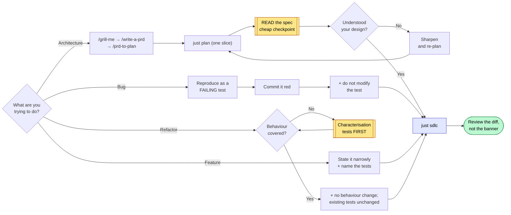
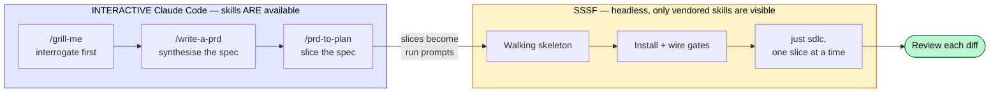
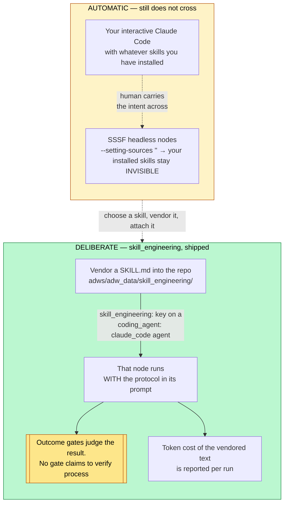

# Adoption playbook

Two situations: a codebase that already exists, and a project that does not yet.
Both start from the same non-negotiable rule.


Rule zero sits early in both parts, not at the end: gates are wired before any
agent writes a line.

---

## Rule zero: wire the gates before an agent writes a line

A freshly stamped factory ships every quality block as an `echo` that exits 0.
Run a workflow against it and you get a green trace that proves nothing — the
agent's claim went unchecked and the run *reported success*. This is worse than
having no factory, because it manufactures confidence.

So the first thing you do in any repo, before any agent writes anything:

```bash
just quality "baseline"        # zero agents — look at what it claims
```

If it says `PLACEHOLDER`, the gates are fake. Wire them in
`adws/adw_modules/quality.py`, then **prove each one can fail**:

```bash
# break exactly one thing, run the gates, confirm exactly one goes red, restore
```

A gate you have not watched fail is not a gate. If a gate stays green against a
deliberately broken build, treat the *check* as the defect, not the tool: the
check does not reach that class of breakage. Do this step before anything else
in the adoption — every later step assumes the gates are real.


Rules for the commands themselves: `argv` is a **list**, never a shell string;
call binaries by bare name so they resolve in the operator's environment; and
put scope and strictness in your config files (`pyproject.toml`,
`package.json`) rather than in the argv, so the gate and a local run can never
disagree.

---

## Part A — an existing codebase

Order: install + recon → wire the gates (rule zero) → set boundaries →
interrogate → work.

### A1. Recon before spending

```bash
cd /path/to/your/repo
uv run /path/to/sssf/.claude/skills/sssf/scripts/install.py
git add -A && git commit -m "Install SSSF"     # keep the tree clean, see A3
just scout "map this codebase: entry points, layers, test setup, build commands"
```

`just scout` is read-only. Its findings land in
`adws/adw_data/sessions/<adw_id>/context_handoff/scout_findings.md`. Read them.
You are checking whether the agent understood your repo before you let it
change anything.

### A2. Wire the gates (rule zero)

Point `test`, `lint` and `typecheck` at your real commands. Delete blocks you
do not have — a `build` block running `echo` is a phantom check, and
`run_quality()` reports it as passed. (That behaviour is in
`adws/adw_modules/quality.py` — read `run_quality()` if you want to see it
yourself rather than take this on trust.)

If your suite is slow, scope the test gate to a fast subset now and widen later.
A gate nobody waits for gets disabled, and a disabled gate is a placeholder with
extra steps.

### A3. Set the boundaries

Two different mechanisms, and people conflate them:

- **`tools`** is a capability list — what the agent *can* do.
- **`writes`** is a boundary — what it *may change in the repo*, enforced after
  every call by diffing the tree.

Both are documented behaviour of the agent runner in `adws/adw_modules/` — grep
for `writes` there to see the enforcement point.

For an existing codebase, tighten `writes` before your first build run.
Give the documenter `docs/` and `**/*.md`. Give the planner `specs/`. Leave the
builder unrestricted only if you are ready to review its whole diff.

`protected_files` is off-limits to everyone: keep `adws/adw_modules/`,
`adws/adw_sssf_config/` and `adws/adw_*.py` in it, so no agent can edit the
machinery that grades its own work. Add your CI config and any secrets path.

**Sharp edge:** the commit phase runs `git add -A` — it stages the *entire*
working tree. Grep for `add -A` in `adws/adw_modules/` to confirm on your
version. Start every run from a clean tree, or your unrelated work in progress
lands in the agent's commit.

### A4. Interrogate before you plan

Same order as Part B, applied to code that already exists: interrogation comes
before spec-writing, spec-writing before slicing.

Do this interactively in Claude Code, where your installed skills are available:

```
/grill-me        interrogate your own intent against the scout findings from
                 A1 — what actually breaks today, what must not change, what
                 you are assuming about the existing design.
/write-a-prd     synthesise that conversation into a spec.
/prd-to-plan     break the spec into slices, each independently shippable.
```

Then hand one slice to SSSF. `just plan` is SSSF's own synthesis step, and it is
downstream of your thinking, not a replacement for it.

### A5. The four jobs



**Improve architecture.** Do not hand this to a build workflow. Grill, spec and
slice first (A4), then plan one slice, read the plan, then decide:

```bash
just plan "extract the payment provider calls behind one interface; no behaviour change"
# read specs/<adw_id>_*.md yourself — this is the cheap checkpoint
just sdlc  "<same slice, once the plan is right>"
```

`just plan` runs the planner alone. Finding out the agent misunderstood your
architecture costs one planner run instead of a full build plus a bad diff.

**Find and fix bugs.** The fix loop is a repair machine, so give it something
red to repair. Reproduce the bug as a failing test first — by hand, or with a
cheap agent — commit it red, then:

```bash
just sdlc "make the failing test in tests/test_x.py pass; do not modify the test"
```

The `do not modify the test` clause matters: the builder has write access, and
deleting an assertion is the cheapest path to green. Constrain it explicitly
rather than relying on virtue you have not asked for.

**Implement a feature.** The main line. Keep the slice narrow enough that one
plan can express it:

```bash
just sdlc "add X; follow existing conventions; add tests covering A, B and C"
```

Cost scales with plan size. Measure your own first few runs with `just sessions`
before you budget the rest.

**Refactor into reusable abstractions.** The most dangerous job, because
"working" and "unchanged" are different claims. Refactoring is only safe behind
tests that pin *current* behaviour, so:

1. Check coverage of the code you are about to move. If it is thin, spend a run
   adding characterisation tests **first**, and commit them.
2. Then refactor with an explicit no-behaviour-change constraint:

```bash
just sdlc "extract the discount rules in the cart-pricing module behind one interface. No behaviour change: every existing test must pass unchanged. Do not modify or delete any existing test."
```

The green suite is your evidence the refactor was safe. Without it you are not
refactoring, you are rewriting and hoping.

### A6. Read what happened

```bash
just sessions            # last runs, cost, status
just phases <adw_id>     # which phase did what
```

Check cost per run early and often, and build your own baseline from those
numbers — no figure from someone else's repo transfers to yours. If one agent
is eating most of your spend, try a cheaper model on it and compare both the
price *and* the output it produces. Do not assume the expensive model plans
better; run the same prompt through both on your own repo and read the two
specs.

---

## Part B — a new project



### B1. Think before there is code (interactive, not SSSF)

SSSF is an execution engine. It is the wrong tool for deciding what to build.

Do this part **interactively** in Claude Code, where your installed skills are
available. The order matters, and it is the reverse of what most people assume:

```
/grill-me        interrogate relentlessly, round after round, until nothing
                 important is left silently assumed. This happens BEFORE any
                 spec exists — it is how you reach shared understanding.
/write-a-prd     synthesise that conversation into a structured spec.
                 No interrogation here; it already happened.
/prd-to-plan     break the spec into slices, each independently shippable and
                 verifiable, with explicit blocking order.
```

Skipping the grill and starting at the spec produces a document that reads well
and encodes assumptions nobody tested. The spec step is downstream of the
thinking, not a substitute for it.

**What the difference looks like.** Same feature request — "let users export
their data" — written two ways.

Straight to spec, no interrogation:

```
Add a data export feature. Users can export their data as CSV.
Acceptance: user clicks Export, receives a CSV file.
```

After a grill that asked which data, how much, who is allowed, and what happens
when it is slow:

```
Export scope: only records the requesting user owns (confirmed: no team-shared
  records in v1).
Volume: 95th percentile account is ~40k rows → synchronous download times out.
  Export is a background job; user gets an email link. Link expires in 24h.
Format: CSV only. JSON was requested and deferred — decided in the grill, not
  discovered mid-build.
Excluded: soft-deleted records, other users' PII in shared audit rows.
Acceptance: 40k-row account exports without timeout; a user cannot export a
  record they do not own; expired link returns 410.
```

The second is not longer for its own sake. Every extra line is a question that
would otherwise have been answered by the agent guessing, mid-build.

> **Why still interactive:** SSSF agents run with `--setting-sources ''`, so
> they cannot see the skills installed on your machine. Grep the agent launch
> args in `adws/adw_modules/` to confirm. That has always been true and remains
> true. The addition is the `skill_engineering:` config key: a *specific named*
> skill can be vendored into the repo and attached to one agent (see "Where the
> two layers sit"), so the two layers can meet — but only for skills you choose
> on purpose, and only for `claude_code` agents. Your general interactive
> toolkit is still yours alone.

### B2. Make it a repo with a walking skeleton

```bash
mkdir project && cd project && git init
```

Before installing SSSF, build the thinnest thing that runs and is tested — by
hand or in one interactive session:

- one real module with one real function
- a test runner that works, with at least one passing test
- lint and typecheck configured

This is the target the factory needs. An empty repo gives the gates nothing to
check, and you are back to placeholder-green.

```bash
git add -A && git commit -m "Walking skeleton"
```

### B3. Install and wire (rule zero)

```bash
uv run /path/to/sssf/.claude/skills/sssf/scripts/install.py
# wire quality.py to your real commands, then prove each gate fails
just quality "gates wired"
git add -A && git commit -m "Install SSSF and wire the gates"
```

### B4. Tune the roster

Start with everything on `claude_code` — no API key, uses your logged-in
session. Then:

- `writes: []` on every read-only agent (scout, reviewer)
- documenter limited to docs paths
- planner limited to `specs/`
- cheap model on scout and documenter, stronger on planner and reviewer
- add your CI config to `protected_files`

### B5. Run the slices, one at a time

Feed the slices from B1 in one at a time:

```bash
just sdlc "<one slice, stated as an outcome with its acceptance criteria>"
```

Review every diff before starting the next. The factory removes typing, not
judgement. One slice per run keeps the blast radius small and the plan cheap.

---

## The standing checklist

Before any run that writes:

- [ ] tree is clean (`git status`) — the commit phase stages everything
- [ ] gates wired, and each one watched failing at least once
- [ ] `writes` set for every agent that should not touch the whole repo
- [ ] `protected_files` covers CI config and the factory's own machinery
- [ ] you are on a branch you are willing to throw away

After:

- [ ] read the diff, not just the green banner
- [ ] `just sessions` — did it cost what you expected
- [ ] if a gate never went red across several runs, suspect the gate

## Where the two layers sit

Skill vendoring ships in the current version of SSSF: the vendoring command and
the `skill_engineering:` config key are both present. The layers meet on
purpose, one skill at a time:



How it works. Each claim below is documented behaviour you can verify in
`adws/adw_sssf_config/sssf.config.yaml` and the agent runner in
`adws/adw_modules/`:

- **Vendor** the skill file into the repo with the vendoring command. The text
  now lives in your tree, versioned with your code.
- **Attach** it with the `skill_engineering:` config key on an agent in
  `sssf.config.yaml`. That agent's prompt carries the protocol.
- **`claude_code` only.** Agents configured as `pi` or `agy` ignore the key —
  check where `skill_engineering` is read in `adws/adw_modules/` to confirm on
  your version.
- **Cost is visible.** Vendored skill text is real tokens on every call that
  agent makes, and the run reports it in the session record `just sessions`
  reads. Attach protocols you want, not every protocol you own.

## What this playbook does not claim

- That agent output needs no review. Agents fabricate confidently, including
  about their own work. Read the diff before you keep it.
- That vendoring a skill makes an agent follow it. Attaching `tdd` puts the
  protocol in the prompt. Nothing verifies the agent worked test-first — the
  gates judge the outcome, not the process. That distinction is the point.
- That any cost figure transfers to your repo. Language, suite size, and repo
  shape dominate. Measure your own on a throwaway branch before budgeting.

## Version history

| Version | Date | Changes |
|---|---|---|
| 2.1 | 2026-08-31 | Removed the last cost figures so the measure-it-yourself stance is consistent. Reframed gate predictions as conditional instructions. Propagated the grill → spec → slice order into Part A as a new A4 step. Unified naming on `/grill-me`, `/write-a-prd`, `/prd-to-plan` and on "slice" as the work unit. Moved rule zero early in the entry diagram to match the prose. Added verification pointers for every mechanism claim, a worked grilled-vs-ungrilled spec example, and made the `--setting-sources` note self-contained. |
| 2.0 | 2026-08-31 | Rewrote as a general adoption playbook: removed session- and repo-specific anecdotes and cost figures in favour of measure-it-yourself guidance. Corrected the Part B interactive workflow order (grill → spec → plan) and each step's purpose. Rewrote "Where the two layers sit" to describe skill_engineering as shipped — vendoring command, `skill_engineering:` config key, `claude_code`-only, per-run cost visibility. |
| 1.1 | 2026-08-25 | Added five Mermaid diagrams: the entry fork, the gate-verification loop, the four-jobs decision tree, the interactive-vs-headless split, and where the two layers sit today versus after skill_engineering. |
| 1.0 | 2026-08-25 | Initial playbook: existing-codebase adoption, new-project bootstrap, and the standing checklist. |
