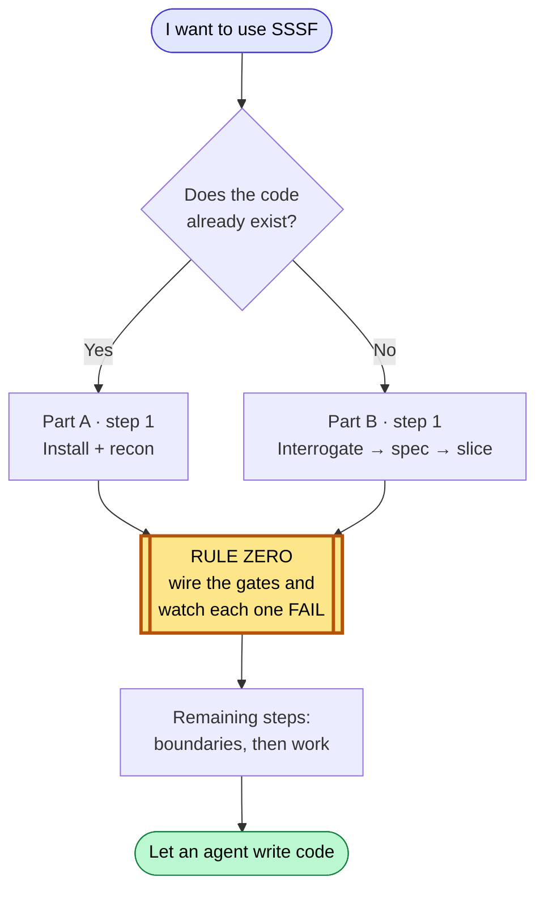
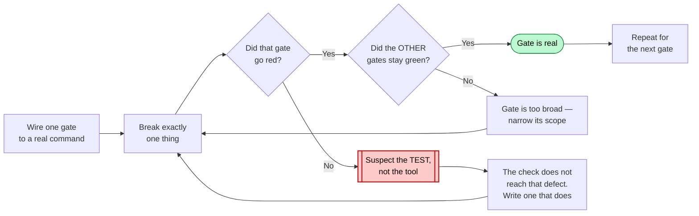
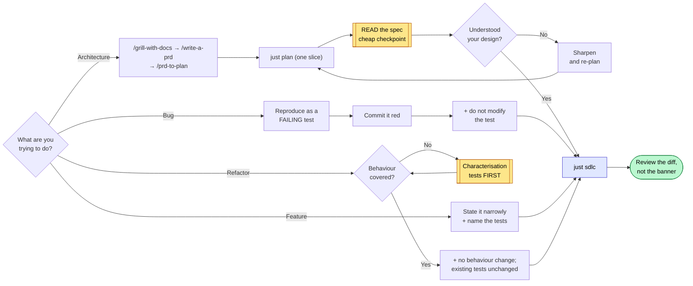
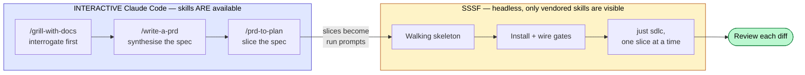
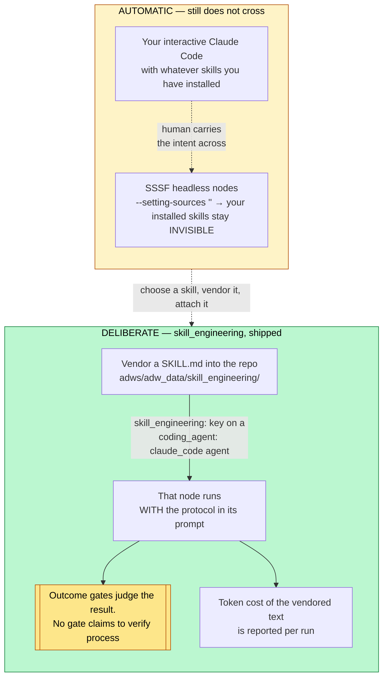
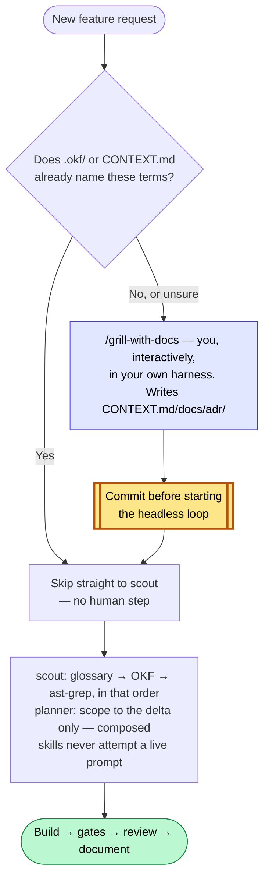
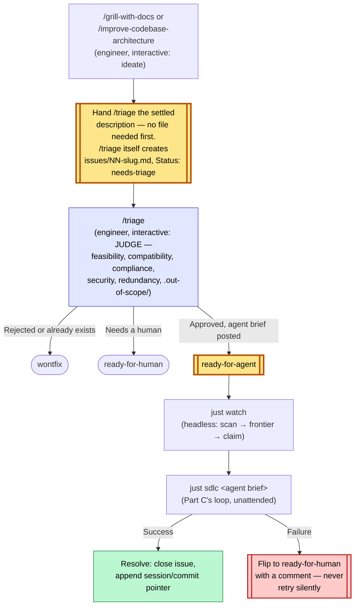

# Adoption playbook

Two situations: a codebase that already exists, and a project that does not yet.
Both start from the same non-negotiable rule.



Rule zero sits early in both parts, not at the end: gates are wired before any
agent writes a line.

---

## Rule zero: wire the gates before an agent writes a line

A freshly stamped factory ships every quality block as an `echo` that exits 0.
Run a workflow against it and you get a green trace that proves nothing — the
agent's claim went unchecked and the run *reported success*. This is worse than
having no factory, because it manufactures confidence.

So the first thing you do in any repo, before any agent writes anything:

```bash
just quality "baseline"        # zero agents — look at what it claims
```

If it says `PLACEHOLDER`, the gates are fake. Wire them in
`adws/adw_modules/quality.py`, then **prove each one can fail**:

```bash
# break exactly one thing, run the gates, confirm exactly one goes red, restore
```

A gate you have not watched fail is not a gate. If a gate stays green against a
deliberately broken build, treat the *check* as the defect, not the tool: the
check does not reach that class of breakage. Do this step before anything else
in the adoption — every later step assumes the gates are real.



Rules for the commands themselves: `argv` is a **list**, never a shell string;
call binaries by bare name so they resolve in the operator's environment; and
put scope and strictness in your config files (`pyproject.toml`,
`package.json`) rather than in the argv, so the gate and a local run can never
disagree.

---

## Part A — an existing codebase

Order: install + recon → wire the gates (rule zero) → set boundaries →
interrogate → work.

### A1. Recon before spending

```bash
cd /path/to/your/repo
uv run /path/to/sssf/.claude/skills/sssf/scripts/install.py
git add -A && git commit -m "Install SSSF"     # keep the tree clean, see A3
just scout "map this codebase: entry points, layers, test setup, build commands"
```

`just scout` is read-only. Its findings land in
`adws/adw_data/sessions/<adw_id>/context_handoff/scout_findings.md`. Read them.
You are checking whether the agent understood your repo before you let it
change anything.

### A2. Wire the gates (rule zero)

Point `test`, `lint` and `typecheck` at your real commands. Delete blocks you
do not have — a `build` block running `echo` is a phantom check, and
`run_quality()` reports it as passed. (That behaviour is in
`adws/adw_modules/quality.py` — read `run_quality()` if you want to see it
yourself rather than take this on trust.)

If your suite is slow, scope the test gate to a fast subset now and widen later.
A gate nobody waits for gets disabled, and a disabled gate is a placeholder with
extra steps.

### A3. Set the boundaries

Two different mechanisms, and people conflate them:

- **`tools`** is a capability list — what the agent *can* do.
- **`writes`** is a boundary — what it *may change in the repo*, enforced after
  every call by diffing the tree.

Both are documented behaviour of the agent runner in `adws/adw_modules/` — grep
for `writes` there to see the enforcement point.

For an existing codebase, tighten `writes` before your first build run.
Give the documenter `docs/` and `**/*.md`. Give the planner `specs/`. Leave the
builder unrestricted only if you are ready to review its whole diff.

`protected_files` is off-limits to everyone: keep `adws/adw_modules/`,
`adws/adw_sssf_config/` and `adws/adw_*.py` in it, so no agent can edit the
machinery that grades its own work. Add your CI config and any secrets path.

**Sharp edge:** the commit phase runs `git add -A` — it stages the *entire*
working tree. Grep for `add -A` in `adws/adw_modules/` to confirm on your
version. Start every run from a clean tree, or your unrelated work in progress
lands in the agent's commit.

### A4. Interrogate before you plan

Same order as Part B, applied to code that already exists: interrogation comes
before spec-writing, spec-writing before slicing.

Do this interactively in Claude Code, where your installed skills are available:

```
/grill-with-docs interrogate your own intent against the scout findings from
                 A1 — what actually breaks today, what must not change, what
                 you are assuming about the existing design. Writes the
                 resolved vocabulary to CONTEXT.md/docs/adr/ as you go.
/write-a-prd     synthesise that conversation into a spec.
/prd-to-plan     break the spec into slices, each independently shippable.
```

Then hand one slice to SSSF. `just plan` is SSSF's own synthesis step, and it is
downstream of your thinking, not a replacement for it.

### A5. The four jobs



**Improve architecture.** Do not hand this to a build workflow. Grill, spec and
slice first (A4), then plan one slice, read the plan, then decide:

```bash
just plan "extract the payment provider calls behind one interface; no behaviour change"
# read specs/<adw_id>_*.md yourself — this is the cheap checkpoint
just sdlc  "<same slice, once the plan is right>"
```

`just plan` runs the planner alone. Finding out the agent misunderstood your
architecture costs one planner run instead of a full build plus a bad diff.

**Find and fix bugs.** The fix loop is a repair machine, so give it something
red to repair. Reproduce the bug as a failing test first — by hand, or with a
cheap agent — commit it red, then:

```bash
just sdlc "make the failing test in tests/test_x.py pass; do not modify the test"
```

The `do not modify the test` clause matters: the builder has write access, and
deleting an assertion is the cheapest path to green. Constrain it explicitly
rather than relying on virtue you have not asked for.

**Implement a feature.** The main line. Keep the slice narrow enough that one
plan can express it:

```bash
just sdlc "add X; follow existing conventions; add tests covering A, B and C"
```

Cost scales with plan size. Measure your own first few runs with `just sessions`
before you budget the rest.

**Refactor into reusable abstractions.** The most dangerous job, because
"working" and "unchanged" are different claims. Refactoring is only safe behind
tests that pin *current* behaviour, so:

1. Check coverage of the code you are about to move. If it is thin, spend a run
   adding characterisation tests **first**, and commit them.
2. Then refactor with an explicit no-behaviour-change constraint:

```bash
just sdlc "extract the discount rules in the cart-pricing module behind one interface. No behaviour change: every existing test must pass unchanged. Do not modify or delete any existing test."
```

The green suite is your evidence the refactor was safe. Without it you are not
refactoring, you are rewriting and hoping.

### A6. Read what happened

```bash
just sessions            # last runs, cost, status
just phases <adw_id>     # which phase did what
```

Check cost per run early and often, and build your own baseline from those
numbers — no figure from someone else's repo transfers to yours. If one agent
is eating most of your spend, try a cheaper model on it and compare both the
price *and* the output it produces. Do not assume the expensive model plans
better; run the same prompt through both on your own repo and read the two
specs.

---

## Part B — a new project



### B1. Think before there is code (interactive, not SSSF)

SSSF is an execution engine. It is the wrong tool for deciding what to build.

Do this part **interactively** in Claude Code, where your installed skills are
available. The order matters, and it is the reverse of what most people assume:

```
/grill-with-docs interrogate relentlessly, round after round, until nothing
                 important is left silently assumed. This happens BEFORE any
                 spec exists — it is how you reach shared understanding.
                 Writes the resolved vocabulary to CONTEXT.md/docs/adr/ as
                 you go, so it survives past this conversation.
/write-a-prd     synthesise that conversation into a structured spec.
                 No interrogation here; it already happened.
/prd-to-plan     break the spec into slices, each independently shippable and
                 verifiable, with explicit blocking order.
```

Skipping the grill and starting at the spec produces a document that reads well
and encodes assumptions nobody tested. The spec step is downstream of the
thinking, not a substitute for it.

**What the difference looks like.** Same feature request — "let users export
their data" — written two ways.

Straight to spec, no interrogation:

```
Add a data export feature. Users can export their data as CSV.
Acceptance: user clicks Export, receives a CSV file.
```

After a grill that asked which data, how much, who is allowed, and what happens
when it is slow:

```
Export scope: only records the requesting user owns (confirmed: no team-shared
  records in v1).
Volume: 95th percentile account is ~40k rows → synchronous download times out.
  Export is a background job; user gets an email link. Link expires in 24h.
Format: CSV only. JSON was requested and deferred — decided in the grill, not
  discovered mid-build.
Excluded: soft-deleted records, other users' PII in shared audit rows.
Acceptance: 40k-row account exports without timeout; a user cannot export a
  record they do not own; expired link returns 410.
```

The second is not longer for its own sake. Every extra line is a question that
would otherwise have been answered by the agent guessing, mid-build.

> **Why still interactive:** SSSF agents run with `--setting-sources ''`, so
> they cannot see the skills installed on your machine. Grep the agent launch
> args in `adws/adw_modules/` to confirm. That has always been true and remains
> true. The addition is the `skill_engineering:` config key: a *specific named*
> skill can be vendored into the repo and attached to one agent (see "Where the
> two layers sit"), so the two layers can meet — but only for skills you choose
> on purpose, and only for the coding agents SSSF knows how to hand a system
> prompt to (currently all four it ships with). Your general interactive
> toolkit is still yours alone.

### B2. Make it a repo with a walking skeleton

```bash
mkdir project && cd project && git init
```

Before installing SSSF, build the thinnest thing that runs and is tested — by
hand or in one interactive session:

- one real module with one real function
- a test runner that works, with at least one passing test
- lint and typecheck configured

This is the target the factory needs. An empty repo gives the gates nothing to
check, and you are back to placeholder-green.

```bash
git add -A && git commit -m "Walking skeleton"
```

### B3. Install and wire (rule zero)

```bash
uv run /path/to/sssf/.claude/skills/sssf/scripts/install.py
# wire quality.py to your real commands, then prove each gate fails
just quality "gates wired"
git add -A && git commit -m "Install SSSF and wire the gates"
```

### B4. Tune the roster

Start with everything on `claude_code` — no API key, uses your logged-in
session. Then:

- `writes: []` on every read-only agent (scout, reviewer)
- documenter limited to docs paths
- planner limited to `specs/`
- cheap model on scout and documenter, stronger on planner and reviewer
- add your CI config to `protected_files`

### B5. Run the slices, one at a time

Feed the slices from B1 in one at a time:

```bash
just sdlc "<one slice, stated as an outcome with its acceptance criteria>"
```

Review every diff before starting the next. The factory removes typing, not
judgement. One slice per run keeps the blast radius small and the plan cheap.

---

## The standing checklist

Before any run that writes:

- [ ] tree is clean (`git status`) — the commit phase stages everything
- [ ] gates wired, and each one watched failing at least once
- [ ] `writes` set for every agent that should not touch the whole repo
- [ ] `protected_files` covers CI config and the factory's own machinery
- [ ] you are on a branch you are willing to throw away

After:

- [ ] read the diff, not just the green banner
- [ ] `just sessions` — did it cost what you expected
- [ ] if a gate never went red across several runs, suspect the gate

## Where the two layers sit

Skill vendoring ships in the current version of SSSF: the vendoring command and
the `skill_engineering:` config key are both present. The layers meet on
purpose, one skill at a time:



How it works. Each claim below is documented behaviour you can verify in
`adws/adw_sssf_config/sssf.config.yaml` and the agent runner in
`adws/adw_modules/`:

- **Vendor** the skill file into the repo with the vendoring command. The text
  now lives in your tree, versioned with your code.
- **Attach** it with the `skill_engineering:` config key on an agent in
  `sssf.config.yaml`. That agent's prompt carries the protocol.
- **Every coding agent, delivered differently.** `claude_code` and `pi` both
  take it as a real `--system-prompt` CLI flag; `agy` and `opencode` have no
  such flag, so they fold it into the user turn instead — weaker (advice
  inside the conversation, not a separate channel) but it arrives. Check
  `skill_engineering_applies()` in `adws/adw_modules/agents.py` to confirm
  which coding agents are covered on your version; a future coding agent
  added to SSSF needs a deliberate addition there before this key does
  anything for it.
- **Cost is visible.** Vendored skill text is real tokens on every call that
  agent makes, and the run reports it in the session record `just sessions`
  reads. Attach protocols you want, not every protocol you own.

## Part C — going dark: bootstrap vocabulary once, then let the loop run headless

Parts A and B get you to `just sdlc` running safely. This part is what "dark
factory" adds on top: minimal human intervention *across many features*, not
just within one run. Two problems block that, and both have the same shape —
something a human normally supplies mid-conversation has to be supplied
*before* the headless loop starts instead, or the loop stalls or guesses.



### Problem 1 — the interview `write-a-prd` wants doesn't have anyone to answer it

`write-a-prd` (and `wayfinder`'s "ask the user how to proceed" fallback) are
written for an interactive session — a human on the other end who answers
back. Vendored under `skill_engineering:` and run by a headless `claude_code`
node, there is no one there. Best case the model role-plays both sides and you
get a low-fidelity PRD with none of the interview's real value; worst case it
tries to prompt and the run hangs waiting for input that never comes.

**Do not delete the interview — relocate it.** The interview is genuinely how
a project converges on shared vocabulary (what does "cancellation" mean here,
is "account" the Customer or the User), and that can't be skipped just because
a run is unattended. Split it into two phases that run in different modes:

- **Bootstrap, human-supervised, outside the headless loop.** When a feature
  introduces domain concepts your project hasn't named yet, run
  `/grill-with-docs` yourself — interactively, in whichever harness you're in.
  It composes `grilling` (the relentless interview) with `domain-modeling`
  (writes the resolved vocabulary into `CONTEXT.md`/`docs/adr/` — durable and
  citable, not prose trapped in one PRD). Approve it, then **commit
  `CONTEXT.md`/`docs/adr/` before starting `just sdlc`** — scout and planner
  read them from the working tree, not from any live session. Skipping the
  commit makes the whole bootstrap step invisible to the pipeline.
- **AFK, headless, the common case.** If the request only composes concepts
  `CONTEXT.md` already names, skip bootstrap entirely — there's nothing left
  to interview about. `write-a-prd` runs unmodified (do not edit the vendored
  copy) and degrades to pure PRD-formatting from already-agreed vocabulary.
  Add this to your `skill_engineering`-attached agent's own `system.md` (not
  the vendored skill file) so it knows what to do when the composed skill text
  below it says "ask the user":

  - `wayfinder` finds no fog → continue directly into `write-a-prd`, don't
    stop and ask how to proceed.
  - `write-a-prd` never prompts. If it hits a genuine ambiguity `CONTEXT.md`
    can't resolve, it says so in the plan and in `notes_for_next_agent`,
    proposes a best-guess term explicitly labeled provisional, and flags that
    a human should run the bootstrap interview before the plan is final —
    it does not guess silently and does not attempt to prompt.
  - `prd-to-plan`'s "ask the user to paste it" branch never applies in-loop —
    the PRD is always already in context from the prior step in the same
    composed prompt.

`grill-with-docs` should stay **out of `skill_engineering/`** — its
`disable-model-invocation: true` is load-bearing, not an oversight. Vendoring
it risks it landing in an agent's composed prompt and firing headless despite
that flag, which is exactly the failure this split exists to prevent.

### Problem 2 — nothing stops a plan from re-implementing what already exists

Neither `prompt_engineering/` nor any shipped `skill_engineering/` skill tells
scout or the planner to check what's already built before scoping new work.
Left unfixed, every feature costs a full plan-and-build cycle even when 80% of
it already exists — the opposite of minimal diff.

Add two lookups to **scout's `system.md`**, before any other search:

1. **Glossary first**, if `CONTEXT.md`/`docs/adr/` exist (see Problem 1) —
   note any request term missing or conflicting; that's a signal for the
   planner, not something scout resolves itself.
2. **A structured knowledge source second**, if your project maintains one —
   an OKF-style knowledge bundle, a `CONTEXT.md`-linked concept map, or
   similar. Report what's *already implemented* and how, cited by concept
   path, not line numbers, which drift.
3. **A structural code search third** (e.g. `ast-grep`) to confirm the
   knowledge source's claims against actual code. Documentation can lag;
   ground truth doesn't. When they disagree, trust the code and flag the doc
   as stale.

Then in **planner's `system.md`**: read scout's findings first, and scope the
plan to the delta only — anything scout already marked implemented is
explicitly out of scope, not silently re-touched.

None of this needs a new SSSF agent role or a new `skill_engineering` entry —
`ast-grep` and a knowledge-source lookup are tool-usage patterns baked into
scout's own instructions, the same way `writes` and `protected_files` already
are. They don't belong in the same composition list as `wayfinder`/
`write-a-prd`/`prd-to-plan`/`tdd`, which are planning methodologies.

### Definition of done, extended

Everything in the standing checklist above, plus:

- [ ] If bootstrap ran, `CONTEXT.md`/`docs/adr/` are committed and predate the
      `just sdlc` run that used them.
- [ ] The plan explicitly excludes anything scout marked as already
      implemented — check `specs/<adw_id>_*.md` names what it's *not* doing,
      not just what it is.
- [ ] Your knowledge source (OKF, concept map, whatever you use) got updated
      by the documenter stage if the feature changed anything it describes —
      otherwise the next feature's discovery step is reading stale claims.

## Part D — the queue: from `ready-for-agent` to shipped

Part C gets one feature through the headless loop unattended. This part is
what turns that into a standing queue: an engineer files or triages work
whenever they want, and something — `just watch`, watching — picks it up and
ships it without anyone manually running `just sdlc` per item.



### Filing: less manual than it looks, but one real gap remains

**Correction (v4.5):** earlier versions of this section claimed nothing
writes `issues/NN-slug.md`. Traced against a real repo's filed tickets and
that's wrong for that file specifically — `/triage`'s own "apply the
outcome" step, for `ready-for-agent`, is *"post an agent brief comment,"* and
`docs/agents/issue-tracker.md` says *"when a skill says 'publish to the
issue tracker' → create a new file."* On the local-markdown tracker, `/triage`
posting its agent brief on a not-yet-tracked item **is** the file-creation
event — verified by content only `/triage`'s documented flow produces (a
`.out-of-scope/` prior-rejection check, a redundancy check, the exact
category/state role vocabulary) showing up inside filed issue files that
were never touched by any other skill. So: **`/triage` files
`issues/NN-slug.md` itself**, one full pass per item, as long as it's handed
something to triage.

The remaining gap is narrower and upstream of that: `grill-with-docs`
(`grilling` + `domain-modeling`) and `improve-codebase-architecture`'s
grilling loop both end at updated `CONTEXT.md`/`docs/adr/` — **neither hands
`/triage` anything.** Something still has to turn "we settled on this" into
the first description `/triage` can act on. That's the actual manual step:
you (or an assisting agent, same interactive session) either invoke `/triage`
directly with the settled description in natural language (no file needed
first — triage creates it), or write a minimal stub yourself if you want the
file to exist before triage runs.

**Pick the shape**, per `docs/agents/issue-tracker.md`'s own convention:

- **New feature** → `.scratch/<feature-slug>/spec.md` — a PRD (problem,
  solution, user stories). `/write-a-prd` writes this directly; no manual
  step here at all once you've run it.
- **Addition to an existing feature** → `.scratch/<existing-feature-slug>/issues/NN-<slug>.md`,
  `NN` the next free number in that feature's `issues/` dir. Numbers are
  scoped per feature, not global — a `Blocked by: 01` in one feature never
  refers to another feature's `01`. Hand `/triage` the description; it files
  the ticket.

**If you write a stub yourself** (rather than handing `/triage` a bare
description), it must contain what `/triage` and `just watch` both actually
parse, not just prose for a human:

```md
# Short title

Status: needs-triage

Whatever the grilling settled on — the decision, the reasoning, any
CONTEXT.md terms or ADRs it touches.
```

- `# Title` — a heading.
- `Status: needs-triage` — exact shape (`Status:` + one of the five canonical
  triage states). `adw_watch.py`'s frontier logic and `/triage`'s state
  machine both key off this line; get the string wrong and both silently
  ignore the file.
- `Blocked by: NN, NN` — optional, only if it depends on another ticket
  already in the same feature's `issues/` dir.

**Then commit it.** `/triage` and `just watch` read from the working tree, not
from your conversation — an uncommitted file is invisible to a fresh session,
same reasoning as committing `CONTEXT.md`/ADRs before the headless loop
starts.

### Mandatory checkpoints — verify the filing actually happened

Every one of these has failed silently on a real repo this playbook was
built against: a skill claims to have written something, and the file isn't
where the claim said, or isn't committed, or the status string doesn't match
what the state machine expects. Run this after `/write-a-prd`, `/prd-to-plan`,
or `/triage` — before assuming the queue can see the work:

```bash
# 1. The feature directory actually exists
ls .scratch/<feature-slug>/                    # expect: spec.md, plan.md (if
                                                 # planned), issues/ (if any
                                                 # scope was deferred)

# 2. spec.md / plan.md exist if the skills that claim to write them ran
test -f .scratch/<feature-slug>/spec.md  && echo "spec.md: present"
test -f .scratch/<feature-slug>/plan.md  && echo "plan.md: present"

# 3. Every issues/ file has a parseable Status: line, exact shape
grep -L "^Status: " .scratch/<feature-slug>/issues/*.md   # empty output = good;
                                                            # any listed file is
                                                            # invisible to both
                                                            # /triage and
                                                            # adw_watch.py's
                                                            # frontier scan

# 4. Status values are one of the five canonical roles — a typo here is
#    silent, not an error
grep -h "^Status: " .scratch/<feature-slug>/issues/*.md \
  | sort -u   # every line must be one of: needs-triage, needs-info,
              # ready-for-agent, ready-for-human, wontfix

# 5. Nothing is sitting uncommitted — invisible to a fresh session, same
#    failure mode as an unwired gate reporting a phantom PASS
git status --short .scratch/<feature-slug>/    # expect: empty

# 6. Blocked-by references actually resolve within the same feature
grep -h "^Blocked by: " .scratch/<feature-slug>/issues/*.md
# then confirm each NN referenced has a matching <feature-slug>/issues/NN-*.md
```

If any of these come back wrong, don't proceed to `just watch` — a `Status:`
typo or an uncommitted file doesn't error, it just makes `adw_watch.py`'s
frontier scan silently skip the item forever, the same class of
manufactures-confidence failure rule zero exists to catch at the gate level.

### The judgment call stays interactive, on purpose

It's tempting to have `just watch` itself analyze a raw issue's feasibility,
compatibility with what's already live, and compliance/security against
`CLAUDE.md`/`AGENTS.md`, `CONTEXT.md`, your knowledge source, and `docs/`/plan
files — then decide whether to build it. Don't: that recreates the exact
failure Part C already fixed once. `write-a-prd`'s interview had no one to
answer it headless; an unattended loop making its own security/compliance
judgment calls has no one to catch it when it's wrong, either.

The `triage` skill (if installed) already does this analysis — feasibility,
redundancy against existing implementation, `.out-of-scope/` prior-rejection
checks, compliance — but it is explicitly interactive: it waits for maintainer
direction at every step and never runs unattended. Its terminal state for
approved work, `ready-for-agent`, means a durable **agent brief** has been
posted to the issue. That's the same pattern as `grill-with-docs`: the
judgment happens once, by a human, and only the *result* — not the judgment
process — becomes something a headless loop can safely consume later.

So: **`just watch` only ever picks up issues already in `ready-for-agent`
state.** Everything that decides whether something is safe, compatible, and
compliant to build happens upstream of that label, interactively. Scout and
planner's Part C wiring (glossary/OKF/ast-grep discovery, delta-scoping) still
runs inside every `just sdlc` call underneath this — defense-in-depth, not a
substitute for the triage gate.

### The queue mechanism already exists — reuse it

Don't build a new work-item format. `docs/agents/issue-tracker.md`'s
"Wayfinding operations" section (written by `/setup-matt-pocock-skills`, see
Part A/B) already defines everything a queue needs: a **map** + numbered
**child** files, a `Blocked by:` line, a **frontier** rule ("scan for files
that are open, unblocked, and unclaimed; first by number wins"), and
**claim**/**resolve** semantics. That's dependency-ordered work-item tracking,
full stop — built for a human working research tickets, but the mechanism
doesn't care who's claiming. `just watch` reuses it verbatim: same frontier
scan, same claim-before-work, same resolve-after-work, just performed by an
agent instead of a human.

This also closes a real gap: a `prd-to-plan` plan's individual **phases**
(Part A5/B1) have no atomic, independently-pickable file of their own by
default — only the feature's `spec.md` does. For a queue to claim work safely,
each phase needs its own issue file, with a `Blocked by:` line expressing
phase ordering (Phase 2 blocked by Phase 1) the same way a wayfinder ticket
blocks on another.

### What `just watch` does, concretely

A polling loop, tracker-aware (reads `docs/agents/issue-tracker.md` to know
whether issues live on GitHub or under `.scratch/`):

1. **Scan** for `ready-for-agent` issues — `gh issue list --label ready-for-agent`
   or grep `Status: ready-for-agent` across `.scratch/*/issues/*.md`.
2. **Frontier**: filter to unblocked (every `Blocked by:` target already
   resolved) and unclaimed; oldest/lowest-numbered first.
3. **Claim**: set `Status: claimed` before touching anything else — same as
   wayfinder, so two concurrent `just watch` runs never double-pick.
4. **Dispatch**: extract the agent brief, run the full SDLC chain on it —
   `adw_simple_sdlc.py` (`planner -> builder -> reviewer -> revision loop ->
   documenter -> commit`), not the lighter `plan_build_test` chain `just
   sdlc` wraps. An unattended dispatch has nothing else checking it besides
   the test gate passing, so it gets the review/revision loop a supervised
   manual run could otherwise skip.
5. **Resolve**: on success, close the issue and append a pointer (session id,
   commit, cost) — mirroring wayfinder's "append a context pointer to the
   map." On failure, flip to `ready-for-human` with a comment explaining what
   broke. Never retry silently — a loop that keeps re-attempting the same
   failure burns money without anyone finding out until later.
6. **Loop** on an interval, or — more composable — run once-and-exit, invoked
   periodically by `cron`/`launchd`/CI outside SSSF's own scope, rather than
   the factory growing its own daemon.

### Definition of done, extended again

Everything in Part C's definition of done, plus:

- [ ] Every issue `just watch` picked up was in `ready-for-agent` state when it
      claimed it — never a raw or `needs-triage` issue.
- [ ] A failed run is `ready-for-human` with a comment explaining what broke,
      not silently retried or left `claimed` forever.
- [ ] Each `prd-to-plan` phase intended for the queue has its own issue file
      with `Blocked by:` expressing phase order, not just a shared `plan.md`.

## What this playbook does not claim

- That agent output needs no review. Agents fabricate confidently, including
  about their own work. Read the diff before you keep it.
- That vendoring a skill makes an agent follow it. Attaching `tdd` puts the
  protocol in the prompt. Nothing verifies the agent worked test-first — the
  gates judge the outcome, not the process. That distinction is the point.
- That any cost figure transfers to your repo. Language, suite size, and repo
  shape dominate. Measure your own on a throwaway branch before budgeting.
- That `just watch`'s current dispatch target (`adw_simple_sdlc.py` — planner
  → builder → reviewer → revision loop → documenter → commit, since 2026-09-10)
  has itself been run live end to end yet. `just watch` **has** claimed and
  shipped two real issues end to end (`opencode-expo`, 2026-09-09/10, real
  cost, real commits) — but both ran before this fix, through the lighter
  chain the watcher used to call, with no reviewer/documenter phase at all.
  That gap (found by reading the diffs afterward, not by anything the queue
  itself caught) is *why* the dispatch target changed. The corrected,
  full-chain dispatch is tested (`tests/test_watch.py` mocks
  `adw_simple_sdlc.main`, same coverage as before) but not yet exercised by a
  real live `just watch` run.

## Version history

| Version | Date | Changes |
|---|---|---|
| 4.5 | 2026-09-10 | Corrected v4.2's Filing claim: `/triage` does write `issues/NN-slug.md` itself — verified against a real repo's filed tickets (`weather-report`), whose content included a `.out-of-scope/` prior-rejection check and the exact category/state role vocabulary that only `/triage`'s documented flow produces, never touched by any other skill. `docs/agents/issue-tracker.md`'s own "publish to the issue tracker → create a new file" rule means `/triage` posting its agent brief on a not-yet-tracked item *is* the file-creation event on the local-markdown tracker. The real gap is narrower and upstream: nothing hands `/triage` the settled description in the first place after `grill-with-docs`/`improve-codebase-architecture` finish. Updated the Filing section and Part D's diagram node accordingly. Added a "Mandatory checkpoints" subsection: concrete shell commands to verify a filing actually landed (directory exists, `Status:` lines present and canonical, nothing uncommitted, `Blocked by:` references resolve) — this class of failure (claimed-but-not-actually-written, or written-but-invisible-to-the-state-machine) is silent, not an error, the same manufactures-confidence risk rule zero exists to catch for quality gates. |
| 4.4 | 2026-09-10 | `just watch` now dispatches through the full SDLC chain (`adw_simple_sdlc.py`: planner → builder → reviewer → revision loop → documenter → commit), not the lighter `plan_build_test` chain it silently used before. Found downstream (`opencode-expo`): its first two real queue dispatches (a PIN-authentication access gate, a biometric-unlock follow-up) both landed with zero review — the watcher had always called `adw_plan_build_test.main()`, which has no reviewer, revision loop, or documenter phase at all. That's a materially bigger gap for an unattended queue than for a manual `just sdlc` run a human reads afterward. `adw_simple_sdlc.main()`'s signature is identical (`prompt, config, adw_id`), confirmed before switching; the roster already had `reviewer`/`documenter` configured, so no config change was needed. Updated Part D's "Dispatch" step description to match. |
| 4.3 | 2026-09-09 | Renamed the `just sssf` recipe to `just watch`, matching its script (`adw_watch.py`) — found via a downstream adoption (`opencode-expo`) questioning the mismatch: 6 of 8 recipes mirror their script name directly, and this one didn't need to be the exception `sdlc` legitimately is (that one names the workflow's meaning, not its script). Updated the recipe, `adw_watch.py`'s own runtime log-line prefixes, `test_watch.py`, and every prescriptive (non-changelog) reference in this playbook's Part D prose and diagram. Also ported back a real bug fix found downstream: `git_helper.py`'s `_git()` did a full `.strip()` on subprocess output, which silently ate the leading space off only the *first* line of multi-line porcelain output (git status codes are leading-whitespace-significant) — corrupting `changed_files()`'s first result. Never reachable before a target repo actually had git history to run these functions against; fixed to `.rstrip()`. |
| 4.2 | 2026-09-09 | Named the filing step Part D's diagram had glossed over: neither `grill-with-docs` nor `improve-codebase-architecture` writes an issue — someone has to manually create `.scratch/<feature>/spec.md` or `issues/NN-slug.md` with a parseable `Status: needs-triage` line before `/triage` can see it. Added a "Filing" subsection with the exact required shape and a new diagram node. |
| 4.1 | 2026-09-09 | Built Part D's `just sssf` for real: `adws/adw_watch.py` (stamped like every other ADW) plus 24 tests covering frontier/blocking/claim/resolve/dispatch/tracker-detection. Updated "What this playbook does not claim" — it's shipped and tested, just not yet run against a real live queue end to end. |
| 4.0 | 2026-09-09 | Added Part D — the queue: turns Part C's single unattended run into a standing queue. Keeps feasibility/compatibility/compliance/security judgment interactive via the `triage` skill (terminal state `ready-for-agent` posts a durable agent brief, same bootstrap-then-headless pattern as `grill-with-docs`); `just sssf` only ever claims already-`ready-for-agent` work. Reuses wayfinder's existing map/child/frontier/claim/resolve mechanism as the queue rather than inventing a new one, and flags the gap it exposes: `prd-to-plan` phases need their own issue files with `Blocked by:` to be queue-pickable. Design only, not yet built. |
| 3.1 | 2026-09-08 | Replaced every `/grill-me` reference (A4, A5, B1) with `/grill-with-docs`. `grill-me` is a bare alias for the `grilling` interview with no artifact output; `grill-with-docs` composes the same interview with `domain-modeling`, writing resolved vocabulary to `CONTEXT.md`/`docs/adr/`. Part C's AFK mechanism depends on that vocabulary existing on disk for scout/planner to read — `grill-me` alone can't produce it, so the playbook now names one interview skill throughout, and it's the AFK-sufficient one. |
| 3.0 | 2026-09-08 | Added Part C — going dark: relocates `write-a-prd`/`wayfinder`'s interactive interview to a human-supervised bootstrap phase (`/grill-with-docs`, writes `CONTEXT.md`/`docs/adr/`, committed before the headless loop starts) so the AFK loop never needs to prompt live; adds glossary → knowledge-source → structural-search discovery to scout before planning, so plans scope to the delta instead of re-implementing what exists. Generalized from a same-session design pass on a real project (`weather-report`'s `docs/agents/dark-factory-protocol.md`), which stays as that project's concrete instance of this part. |
| 2.1 | 2026-08-31 | Removed the last cost figures so the measure-it-yourself stance is consistent. Reframed gate predictions as conditional instructions. Propagated the grill → spec → slice order into Part A as a new A4 step. Unified naming on `/grill-me`, `/write-a-prd`, `/prd-to-plan` and on "slice" as the work unit. Moved rule zero early in the entry diagram to match the prose. Added verification pointers for every mechanism claim, a worked grilled-vs-ungrilled spec example, and made the `--setting-sources` note self-contained. |
| 2.0 | 2026-08-31 | Rewrote as a general adoption playbook: removed session- and repo-specific anecdotes and cost figures in favour of measure-it-yourself guidance. Corrected the Part B interactive workflow order (grill → spec → plan) and each step's purpose. Rewrote "Where the two layers sit" to describe skill_engineering as shipped — vendoring command, `skill_engineering:` config key, `claude_code`-only, per-run cost visibility. |
| 1.1 | 2026-08-25 | Added five Mermaid diagrams: the entry fork, the gate-verification loop, the four-jobs decision tree, the interactive-vs-headless split, and where the two layers sit today versus after skill_engineering. |
| 1.0 | 2026-08-25 | Initial playbook: existing-codebase adoption, new-project bootstrap, and the standing checklist. |
