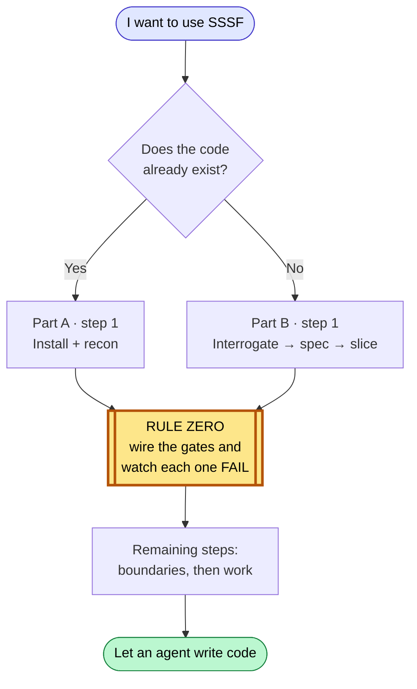
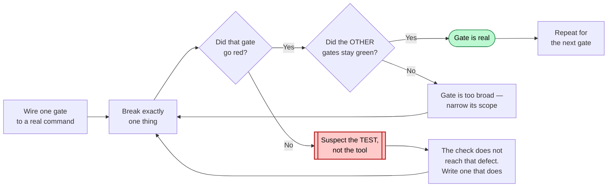
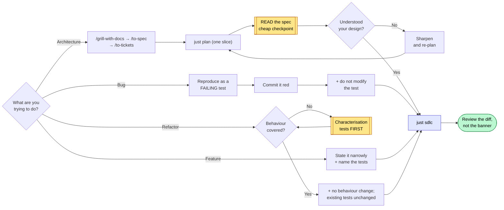
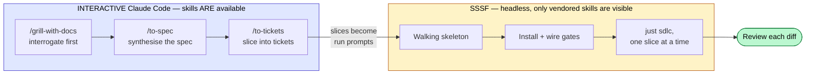
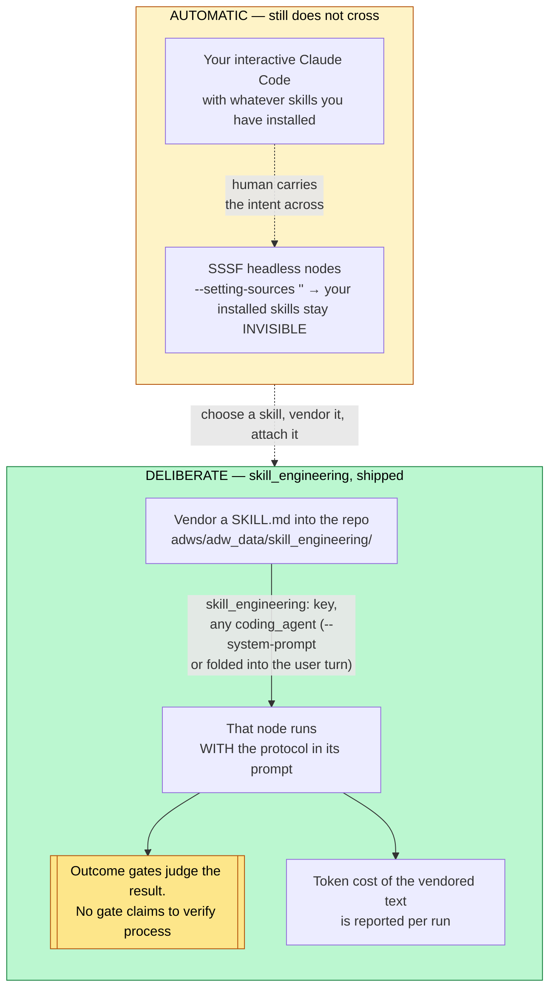
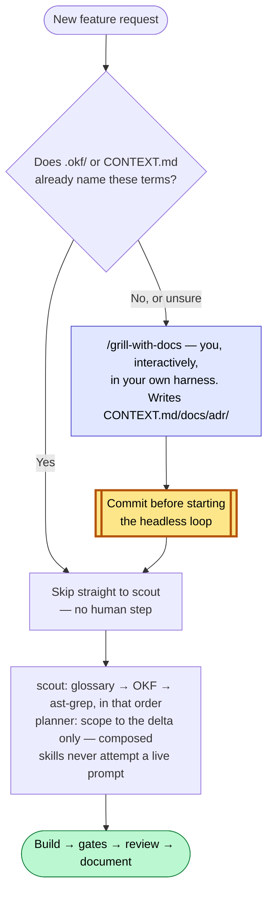
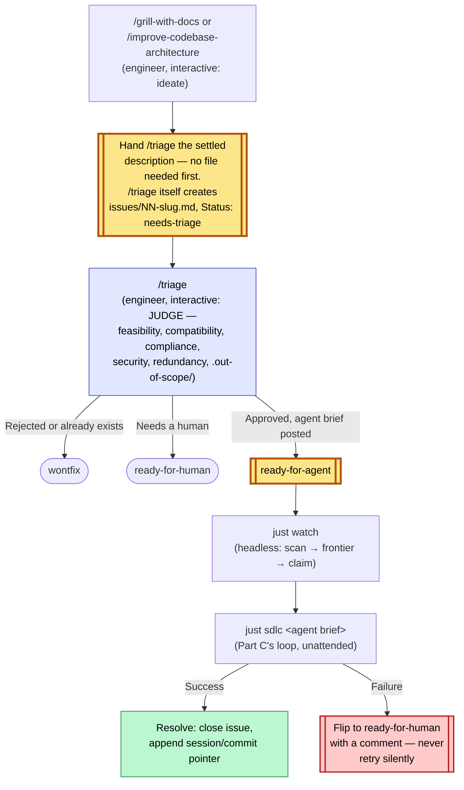

# Adoption playbook

Two situations: a codebase that already exists, and a project that does not yet.
Both start from the same non-negotiable rule.


```mermaid
flowchart TD
    Start([I want to use SSSF]) --> Which{Does the code<br/>already exist?}
    Which -->|Yes| A0[Part A · step 1<br/>Install + recon]
    Which -->|No| B0[Part B · step 1<br/>Interrogate → spec → slice]
    A0 --> Zero
    B0 --> Zero
    Zero[["RULE ZERO<br/>wire the gates and<br/>watch each one FAIL"]] --> Rest[Remaining steps:<br/>boundaries, then work]
    Rest --> Work([Let an agent write code])

    style Zero fill:#fde68a,stroke:#b45309,stroke-width:3px,color:#000
    style Work fill:#bbf7d0,stroke:#15803d,color:#000
    style Start fill:#e0e7ff,stroke:#4338ca,color:#000
```

Rule zero sits early in both parts, not at the end: gates are wired before any
agent writes a line.

---

## Rule zero: wire the gates before an agent writes a line

A freshly stamped factory ships every quality block as an `echo` that exits 0.
Run a workflow against it and you get a green trace that proves nothing — the
agent's claim went unchecked and the run *reported success*. This is worse than
having no factory, because it manufactures confidence.

So the first thing you do in any repo, before any agent writes anything:

```bash
just quality "baseline"        # zero agents — look at what it claims
```

If it says `PLACEHOLDER`, the gates are fake. Wire them in
`adws/adw_modules/quality.py`, then **prove each one can fail**:

```bash
# break exactly one thing, run the gates, confirm exactly one goes red, restore
```

A gate you have not watched fail is not a gate. If a gate stays green against a
deliberately broken build, treat the *check* as the defect, not the tool: the
check does not reach that class of breakage. Do this step before anything else
in the adoption — every later step assumes the gates are real.


```mermaid
flowchart LR
    W[Wire one gate<br/>to a real command] --> B[Break exactly<br/>one thing]
    B --> R{Did that gate<br/>go red?}
    R -->|Yes| O{Did the OTHER<br/>gates stay green?}
    R -->|No| Suspect[["Suspect the TEST,<br/>not the tool"]]
    O -->|Yes| Trust([Gate is real])
    O -->|No| Scope[Gate is too broad —<br/>narrow its scope]
    Suspect --> Fix[The check does not<br/>reach that defect.<br/>Write one that does] --> B
    Scope --> B
    Trust --> Next[Repeat for<br/>the next gate]

    style Suspect fill:#fecaca,stroke:#b91c1c,stroke-width:2px,color:#000
    style Trust fill:#bbf7d0,stroke:#15803d,color:#000
```

Rules for the commands themselves: `argv` is a **list**, never a shell string;
call binaries by bare name so they resolve in the operator's environment; and
put scope and strictness in your config files (`pyproject.toml`,
`package.json`) rather than in the argv, so the gate and a local run can never
disagree.

---

## Part A — an existing codebase

Order: install + recon → wire the gates (rule zero) → set boundaries →
interrogate → work.

### A1. Recon before spending

```bash
cd /path/to/your/repo
uv run /path/to/sssf/.claude/skills/sssf/scripts/install.py
git add -A && git commit -m "Install SSSF"     # keep the tree clean, see A3
just scout "map this codebase: entry points, layers, test setup, build commands"
```

`just scout` is read-only. Its findings land in
`adws/adw_data/sessions/<adw_id>/context_handoff/scout_findings.md`. Read them.
You are checking whether the agent understood your repo before you let it
change anything.

### A2. Wire the gates (rule zero)

Point `test`, `lint` and `typecheck` at your real commands. Delete blocks you
do not have — a `build` block running `echo` is a phantom check, and
`run_quality()` reports it as passed. (That behaviour is in
`adws/adw_modules/quality.py` — read `run_quality()` if you want to see it
yourself rather than take this on trust.)

If your suite is slow, scope the test gate to a fast subset now and widen later.
A gate nobody waits for gets disabled, and a disabled gate is a placeholder with
extra steps.

### A3. Set the boundaries

Two different mechanisms, and people conflate them:

- **`tools`** is a capability list — what the agent *can* do.
- **`writes`** is a boundary — what it *may change in the repo*, enforced after
  every call by diffing the tree.

Both are documented behaviour of the agent runner in `adws/adw_modules/` — grep
for `writes` there to see the enforcement point.

For an existing codebase, tighten `writes` before your first build run.
Give the documenter `docs/` and `**/*.md`. Give the planner `specs/`. Leave the
builder unrestricted only if you are ready to review its whole diff.

`protected_files` is off-limits to everyone: keep `adws/adw_modules/`,
`adws/adw_sssf_config/` and `adws/adw_*.py` in it, so no agent can edit the
machinery that grades its own work. Add your CI config and any secrets path.

**Sharp edge:** the commit phase runs `git add -A` — it stages the *entire*
working tree. Grep for `add -A` in `adws/adw_modules/` to confirm on your
version. Start every run from a clean tree, or your unrelated work in progress
lands in the agent's commit.

### A4. Interrogate before you plan

Same order as Part B, applied to code that already exists: interrogation comes
before spec-writing, spec-writing before slicing.

Do this interactively in Claude Code, where your installed skills are available:

1. `/grill-with-docs` — interrogate your own intent against the scout findings
   from A1: what actually breaks today, what must not change, what you are
   assuming about the existing design. Writes the resolved vocabulary to
   `CONTEXT.md`/`docs/adr/` as you go.
2. `/to-spec` — synthesize that conversation into a spec. No interview; it
   already happened.
3. `/to-tickets` — slice the spec into per-phase tickets with `Blocked by:`
   edges.
4. Both (2) and (3) self-apply `ready-for-agent` by default — see Part D's
   Filing "sharp edge" before committing their output.

Then hand one slice to SSSF. `just plan` is SSSF's own synthesis step, and it is
downstream of your thinking, not a replacement for it.

### A5. The four jobs


```mermaid
flowchart LR
    Job{What are you<br/>trying to do?}

    Job -->|Architecture| A1["/grill-with-docs → /to-spec<br/>→ /to-tickets"]
    A1 --> A2["just plan (one slice)"]
    A2 --> A3[["READ the spec<br/>cheap checkpoint"]]
    A3 --> A4{Understood<br/>your design?}
    A4 -->|No| A5[Sharpen<br/>and re-plan] --> A2
    A4 -->|Yes| Run

    Job -->|Bug| B1[Reproduce as a<br/>FAILING test] --> B2[Commit it red] --> B3["+ do not modify<br/>the test"] --> Run

    Job -->|Feature| C1[State it narrowly<br/>+ name the tests] --> Run

    Job -->|Refactor| D1{Behaviour<br/>covered?}
    D1 -->|No| D2[["Characterisation<br/>tests FIRST"]] --> D1
    D1 -->|Yes| D3["+ no behaviour change;<br/>existing tests unchanged"] --> Run

    Run["just sdlc"] --> Rev([Review the diff,<br/>not the banner])

    style A3 fill:#fde68a,stroke:#b45309,color:#000
    style D2 fill:#fde68a,stroke:#b45309,color:#000
    style Run fill:#e0e7ff,stroke:#4338ca,color:#000
    style Rev fill:#bbf7d0,stroke:#15803d,color:#000
```

**Improve architecture.** Do not hand this to a build workflow. Grill, spec and
slice first (A4), then plan one slice, read the plan, then decide:

```bash
just plan "extract the payment provider calls behind one interface; no behaviour change"
# read specs/<adw_id>_*.md yourself — this is the cheap checkpoint
just sdlc  "<same slice, once the plan is right>"
```

`just plan` runs the planner alone. Finding out the agent misunderstood your
architecture costs one planner run instead of a full build plus a bad diff.

**Find and fix bugs.** The fix loop is a repair machine, so give it something
red to repair. Reproduce the bug as a failing test first — by hand, or with a
cheap agent — commit it red, then:

```bash
just sdlc "make the failing test in tests/test_x.py pass; do not modify the test"
```

The `do not modify the test` clause matters: the builder has write access, and
deleting an assertion is the cheapest path to green. Constrain it explicitly
rather than relying on virtue you have not asked for.

**Implement a feature.** The main line. Keep the slice narrow enough that one
plan can express it:

```bash
just sdlc "add X; follow existing conventions; add tests covering A, B and C"
```

Cost scales with plan size. Measure your own first few runs with `just sessions`
before you budget the rest.

**Refactor into reusable abstractions.** The most dangerous job, because
"working" and "unchanged" are different claims. Refactoring is only safe behind
tests that pin *current* behaviour, so:

1. Check coverage of the code you are about to move. If it is thin, spend a run
   adding characterisation tests **first**, and commit them.
2. Then refactor with an explicit no-behaviour-change constraint:

```bash
just sdlc "extract the discount rules in the cart-pricing module behind one interface. No behaviour change: every existing test must pass unchanged. Do not modify or delete any existing test."
```

The green suite is your evidence the refactor was safe. Without it you are not
refactoring, you are rewriting and hoping.

### A6. Read what happened

```bash
just sessions            # last runs, cost, status
just phases <adw_id>     # which phase did what
```

Check cost per run early and often, and build your own baseline from those
numbers — no figure from someone else's repo transfers to yours. If one agent
is eating most of your spend, try a cheaper model on it and compare both the
price *and* the output it produces. Do not assume the expensive model plans
better; run the same prompt through both on your own repo and read the two
specs.

---

## Part B — a new project


```mermaid
flowchart LR
    subgraph I["INTERACTIVE Claude Code — skills ARE available"]
        direction TB
        P1["/grill-with-docs<br/>interrogate first"] --> P2["/to-spec<br/>synthesise the spec"] --> P3["/to-tickets<br/>slice into tickets"]
    end
    subgraph S["SSSF — headless, only vendored skills are visible"]
        direction TB
        S1[Walking skeleton] --> S2[Install + wire gates] --> S3[just sdlc,<br/>one slice at a time]
    end
    P3 -->|"slices become<br/>run prompts"| S1
    S3 --> Rev([Review each diff])

    style I fill:#e0e7ff,stroke:#4338ca,color:#000
    style S fill:#fef3c7,stroke:#b45309,color:#000
    style Rev fill:#bbf7d0,stroke:#15803d,color:#000
```

### B1. Think before there is code (interactive, not SSSF)

SSSF is an execution engine. It is the wrong tool for deciding what to build.

Do this part **interactively** in Claude Code, where your installed skills are
available. The order matters, and it is the reverse of what most people assume:

1. `/grill-with-docs` — interrogate relentlessly, round after round, until
   nothing important is left silently assumed. This happens BEFORE any spec
   exists — it is how you reach shared understanding. Writes the resolved
   vocabulary to `CONTEXT.md`/`docs/adr/` as you go, so it survives past this
   conversation.
2. `/to-spec` — synthesize that conversation into a structured spec. No
   interrogation here; it already happened.
3. `/to-tickets` — break the spec into per-phase tickets, each independently
   shippable and verifiable, with explicit `Blocked by:` edges.
4. Both (2) and (3) self-apply `ready-for-agent` by default — see Part D's
   Filing "sharp edge" before committing their output.

Skipping the grill and starting at the spec produces a document that reads well
and encodes assumptions nobody tested. The spec step is downstream of the
thinking, not a substitute for it.

**What the difference looks like.** Same feature request — "let users export
their data" — written two ways.

Straight to spec, no interrogation:

```
Add a data export feature. Users can export their data as CSV.
Acceptance: user clicks Export, receives a CSV file.
```

After a grill that asked which data, how much, who is allowed, and what happens
when it is slow:

```
Export scope: only records the requesting user owns (confirmed: no team-shared
  records in v1).
Volume: 95th percentile account is ~40k rows → synchronous download times out.
  Export is a background job; user gets an email link. Link expires in 24h.
Format: CSV only. JSON was requested and deferred — decided in the grill, not
  discovered mid-build.
Excluded: soft-deleted records, other users' PII in shared audit rows.
Acceptance: 40k-row account exports without timeout; a user cannot export a
  record they do not own; expired link returns 410.
```

The second is not longer for its own sake. Every extra line is a question that
would otherwise have been answered by the agent guessing, mid-build.

> **Why still interactive:** SSSF agents run with `--setting-sources ''`, so
> they cannot see the skills installed on your machine. Grep the agent launch
> args in `adws/adw_modules/` to confirm. That has always been true and remains
> true. The addition is the `skill_engineering:` config key: a *specific named*
> skill can be vendored into the repo and attached to one agent (see "Where the
> two layers sit"), so the two layers can meet — but only for skills you choose
> on purpose, and only for the coding agents SSSF knows how to hand a system
> prompt to (currently all four it ships with). Your general interactive
> toolkit is still yours alone.

### B2. Make it a repo with a walking skeleton

```bash
mkdir project && cd project && git init
```

Before installing SSSF, build the thinnest thing that runs and is tested — by
hand or in one interactive session:

- one real module with one real function
- a test runner that works, with at least one passing test
- lint and typecheck configured

This is the target the factory needs. An empty repo gives the gates nothing to
check, and you are back to placeholder-green.

```bash
git add -A && git commit -m "Walking skeleton"
```

### B3. Install and wire (rule zero)

```bash
uv run /path/to/sssf/.claude/skills/sssf/scripts/install.py
# wire quality.py to your real commands, then prove each gate fails
just quality "gates wired"
git add -A && git commit -m "Install SSSF and wire the gates"
```

### B4. Tune the roster

Start with everything on `claude_code` — no API key, uses your logged-in
session. Then:

- `writes: []` on every read-only agent (scout, reviewer)
- documenter limited to docs paths
- planner limited to `specs/`
- cheap model on scout and documenter, stronger on planner and reviewer
- add your CI config to `protected_files`

### B5. Run the slices, one at a time

Feed the slices from B1 in one at a time:

```bash
just sdlc "<one slice, stated as an outcome with its acceptance criteria>"
```

Review every diff before starting the next. The factory removes typing, not
judgement. One slice per run keeps the blast radius small and the plan cheap.

---

## The standing checklist

Before any run that writes:

- [ ] tree is clean (`git status`) — the commit phase stages everything
- [ ] gates wired, and each one watched failing at least once
- [ ] `writes` set for every agent that should not touch the whole repo
- [ ] `protected_files` covers CI config and the factory's own machinery
- [ ] you are on a branch you are willing to throw away

After:

- [ ] read the diff, not just the green banner
- [ ] `just sessions` — did it cost what you expected
- [ ] if a gate never went red across several runs, suspect the gate

## Where the two layers sit

Skill vendoring ships in the current version of SSSF: the vendoring command and
the `skill_engineering:` config key are both present. The layers meet on
purpose, one skill at a time:


```mermaid
flowchart TB
    subgraph AUTO["AUTOMATIC — still does not cross"]
        direction TB
        H1[Your interactive Claude Code<br/>with whatever skills you have installed] -.->|"human carries<br/>the intent across"| H2
        H2["SSSF headless nodes<br/>--setting-sources '' → your installed skills stay INVISIBLE"]
    end

    subgraph DELIB["DELIBERATE — skill_engineering, shipped"]
        direction TB
        L1["Vendor a SKILL.md into the repo<br/>adws/adw_data/skill_engineering/"] -->|"skill_engineering: key,<br/>any coding_agent (--system-prompt<br/>or folded into the user turn)"| L2[That node runs<br/>WITH the protocol in its prompt]
        L2 --> L3[["Outcome gates judge the result.<br/>No gate claims to verify process"]]
        L2 --> L4[Token cost of the vendored text<br/>is reported per run]
    end

    AUTO -.->|"choose a skill, vendor it, attach it"| DELIB

    style AUTO fill:#fef3c7,stroke:#b45309,color:#000
    style DELIB fill:#bbf7d0,stroke:#15803d,color:#000
    style L3 fill:#fde68a,stroke:#b45309,color:#000
```

How it works. Each claim below is documented behaviour you can verify in
`adws/adw_sssf_config/sssf.config.yaml` and the agent runner in
`adws/adw_modules/`:

- **Vendor** the skill file into the repo with the vendoring command. The text
  now lives in your tree, versioned with your code.
- **Attach** it with the `skill_engineering:` config key on an agent in
  `sssf.config.yaml`. That agent's prompt carries the protocol.
- **Every coding agent, delivered differently.** `claude_code` and `pi` both
  take it as a real `--system-prompt` CLI flag; `agy` and `opencode` have no
  such flag, so they fold it into the user turn instead — weaker (advice
  inside the conversation, not a separate channel) but it arrives. Check
  `skill_engineering_applies()` in `adws/adw_modules/agents.py` to confirm
  which coding agents are covered on your version; a future coding agent
  added to SSSF needs a deliberate addition there before this key does
  anything for it.
- **Cost is visible.** Vendored skill text is real tokens on every call that
  agent makes, and the run reports it in the session record `just sessions`
  reads. Attach protocols you want, not every protocol you own.

## Part C — going dark: bootstrap vocabulary once, then let the loop run headless

Parts A and B get you to `just sdlc` running safely. This part is what "dark
factory" adds on top: minimal human intervention *across many features*, not
just within one run. Two problems block that, and both have the same shape —
something a human normally supplies mid-conversation has to be supplied
*before* the headless loop starts instead, or the loop stalls or guesses.


```mermaid
flowchart TD
    Req([New feature request]) --> Check{Does .okf/ or CONTEXT.md<br/>already name these terms?}
    Check -->|Yes| Skip[Skip straight to scout<br/>— no human step]
    Check -->|No, or unsure| Boot["/grill-with-docs — you, interactively,<br/>in your own harness. Writes CONTEXT.md/docs/adr/"]
    Boot --> Commit[["Commit before starting<br/>the headless loop"]]
    Commit --> Skip
    Skip --> ScoutPlan["scout: glossary → OKF → ast-grep, in that order<br/>planner: scope to the delta only — composed<br/>skills never attempt a live prompt"]
    ScoutPlan --> Rest([Build → gates → review → document])

    style Boot fill:#e0e7ff,stroke:#4338ca,color:#000
    style Commit fill:#fde68a,stroke:#b45309,stroke-width:3px,color:#000
    style Rest fill:#bbf7d0,stroke:#15803d,color:#000
```

### Problem 1 — the interview a vendored planning skill wants doesn't have anyone to answer it

`wayfinder`'s "ask the user how to proceed" fallback is written for an
interactive session — a human on the other end who answers
back. Vendored under `skill_engineering:` and run by a headless node — any
`coding_agent` — there is no one there. Best case the model role-plays both sides and you
get a low-fidelity spec with none of the interview's real value; worst case it
tries to prompt and the run hangs waiting for input that never comes.

**Do not delete the interview — relocate it.** The interview is genuinely how
a project converges on shared vocabulary (what does "cancellation" mean here,
is "account" the Customer or the User), and that can't be skipped just because
a run is unattended. Split it into two phases that run in different modes:

- **Bootstrap, human-supervised, outside the headless loop.** When a feature
  introduces domain concepts your project hasn't named yet, run
  `/grill-with-docs` yourself — interactively, in whichever harness you're in.
  It composes `grilling` (the relentless interview) with `domain-modeling`
  (writes the resolved vocabulary into `CONTEXT.md`/`docs/adr/` — durable and
  citable, not prose trapped in one spec). Approve it, then **commit
  `CONTEXT.md`/`docs/adr/` before starting `just sdlc`** — scout and planner
  read them from the working tree, not from any live session. Skipping the
  commit makes the whole bootstrap step invisible to the pipeline.
- **AFK, headless, the common case.** If the request only composes concepts
  `CONTEXT.md` already names, skip bootstrap entirely — there's nothing left
  to interview about. `to-spec` already doesn't interview by design —
  "no interview, just synthesis," per its own frontmatter — so it
  runs unmodified (do not edit the vendored copy) and degrades to pure
  spec-formatting from already-agreed vocabulary. Add this to your
  `skill_engineering`-attached agent's own `system.md` (not the vendored
  skill file) so it knows what to do when the composed skill text below it
  says "ask the user":

  - `wayfinder` finds no fog → continue directly into `to-spec`, don't
    stop and ask how to proceed.
  - `to-spec` never prompts. If it hits a genuine ambiguity `CONTEXT.md`
    can't resolve, it says so in the plan and in `notes_for_next_agent`,
    proposes a best-guess term explicitly labeled provisional, and flags that
    a human should run the bootstrap interview before the plan is final —
    it does not guess silently and does not attempt to prompt.
  - `to-tickets`'s "quiz the user" step never applies in-loop — the spec is
    always already in context from the prior step in the same composed
    prompt.

  Two more overrides belong here, on top of the interview question — both
  `to-spec` and `to-tickets` self-apply the `ready-for-agent` triage label
  by default, which bypasses this pipeline's own `/triage` gate (Part D's
  "the judgment call stays interactive" depends on `/triage` being the only
  promoter):

  - `to-spec` files at `Status: needs-triage`, not the `ready-for-agent` its
    own instructions say to apply. Skipping triage here would let a spec
    bypass this pipeline's own feasibility/compliance/redundancy judgment
    entirely.
  - `to-tickets` files every ticket at `Status: needs-triage` too. Its own
    local-ticket-template uses bold `**Status:**`/`**Blocked by:**` lines —
    `adw_watch.py`'s `STATUS_RE`/`BLOCKED_BY_RE` tolerate up to two leading
    and trailing `*` (`^\*{0,2}Status:\*{0,2}...`), added 2026-09-14 after
    four real portfinder tickets in bold sat invisible to the frontier scan,
    so bold-filed tickets are correctly matched today. What the regex still
    does **not** tolerate: backtick-wrapped `` `Status:` `` — that form
    is a real, still-open gap (see `docs/reference/the-queue/Frontier.md`
    and the queue lesson `06-going-dark`/`07-the-queue` for the current
    state of this).

`grill-with-docs` should stay **out of `skill_engineering/`** — its
`disable-model-invocation: true` is load-bearing, not an oversight. Vendoring
it risks it landing in an agent's composed prompt and firing headless despite
that flag, which is exactly the failure this split exists to prevent.

### Problem 2 — nothing stops a plan from re-implementing what already exists

Neither `prompt_engineering/` nor any shipped `skill_engineering/` skill tells
scout or the planner to check what's already built before scoping new work.
Left unfixed, every feature costs a full plan-and-build cycle even when 80% of
it already exists — the opposite of minimal diff.

Add two lookups to **scout's `system.md`**, before any other search:

1. **Glossary first**, if `CONTEXT.md`/`docs/adr/` exist (see Problem 1) —
   note any request term missing or conflicting; that's a signal for the
   planner, not something scout resolves itself.
2. **A structured knowledge source second**, if your project maintains one —
   an OKF-style knowledge bundle, a `CONTEXT.md`-linked concept map, or
   similar. Report what's *already implemented* and how, cited by concept
   path, not line numbers, which drift.
3. **A structural code search third** (e.g. `ast-grep`) to confirm the
   knowledge source's claims against actual code. Documentation can lag;
   ground truth doesn't. When they disagree, trust the code and flag the doc
   as stale.

Then in **planner's `system.md`**: read scout's findings first, and scope the
plan to the delta only — anything scout already marked implemented is
explicitly out of scope, not silently re-touched.

None of this needs a new SSSF agent role or a new `skill_engineering` entry —
`ast-grep` and a knowledge-source lookup are tool-usage patterns baked into
scout's own instructions, the same way `writes` and `protected_files` already
are. They don't belong in the same composition list as `wayfinder`/
`to-spec`/`to-tickets`/`tdd`, which are planning methodologies.

### The grill → triage handoff is manual, on purpose (accepted, not a gap to close)

`/grill-with-docs` ends at a committed `CONTEXT.md`/`docs/adr/` update; it does
not hand `/triage` anything, and neither does upstream Pocock's own flow (see
`.okf/pocock-skills/naming-drift.md` and the integration plan's finding F2 —
checked against the current upstream skill set too, not just the version this
playbook was originally written against; nothing there bridges it either). The
bootstrap/AFK audit's finding 3.1.3 flagged this as the one place in the whole
pipeline where forgetting a step loses work silently: a grilled-and-settled
feature that never reaches `/triage` never enters the queue, and nothing lists
"settled but unfiled" work.

**Decision: accept this as a manual step, not a mechanism to build.** Closing
it would mean a thin wrapper skill (run `/grill-with-docs`, then `/to-spec`,
then remind `/triage`) — evaluated and deliberately not built, since it adds a
skill to maintain for one reminder a checklist line covers just as well. The
checklist item below is the actual guard.

### Definition of done, extended

Everything in the standing checklist above, plus:

- [ ] If bootstrap ran, `CONTEXT.md`/`docs/adr/` are committed and predate the
      `just sdlc` run that used them.
- [ ] The plan explicitly excludes anything scout marked as already
      implemented — check `specs/<adw_id>_*.md` names what it's *not* doing,
      not just what it is.
- [ ] Your knowledge source (OKF, concept map, whatever you use) got updated
      by the documenter stage if the feature changed anything it describes —
      otherwise the next feature's discovery step is reading stale claims.
- [ ] If this bootstrap session ran because of a fresh grilling
      (`/grill-with-docs` or `/improve-codebase-architecture`), its outcome is
      filed — run `/triage` before leaving the session. Nothing bridges this
      automatically (see above); a settled-but-unfiled grill is invisible to
      the queue, not just slow to reach it.

## Part D — the queue: from `ready-for-agent` to shipped

Part C gets one feature through the headless loop unattended. This part is
what turns that into a standing queue: an engineer files or triages work
whenever they want, and something — `just watch`, watching — picks it up and
ships it without anyone manually running `just sdlc` per item.

**A note on paths in this part.** `docs/agents/issue-tracker.md`,
`.scratch/`, and `sssf.config.yaml` below all mean paths **in the repo you
are adopting SSSF into**, once `install.py` has stamped it and you've set up
the tracker — not paths in this skill-source fork, which has none of them.

### The whole chain, named once

1. `/grill-with-docs` — interactively, commit `CONTEXT.md`/`docs/adr/`.
2. `/to-spec` — synthesize the spec.
3. `/to-tickets` — slice into tickets.
4. `/triage` — the only thing allowed to promote a ticket to
   `ready-for-agent`. (Steps 2–4: see Filing's "sharp edge" — running (2)/(3)
   interactively self-promotes past this gate by default; fix that there,
   not here.)
5. Commit; run the Mandatory checkpoints.
6. `just watch`.


```mermaid
flowchart TD
    Idea["/grill-with-docs or<br/>/improve-codebase-architecture<br/>(engineer, interactive: ideate)"] --> File[["Hand /triage the settled<br/>description — no file needed first.<br/>/triage itself creates<br/>issues/NN-slug.md, Status: needs-triage"]]
    File --> Triage["/triage<br/>(engineer, interactive: JUDGE —<br/>feasibility, compatibility, compliance,<br/>security, redundancy, .out-of-scope/)"]
    Triage -->|Rejected or already exists| Wontfix([wontfix])
    Triage -->|Needs a human| ReadyHuman([ready-for-human])
    Triage -->|Approved, agent brief posted| Ready[["ready-for-agent"]]
    Ready --> Watch["just watch<br/>(headless: scan → frontier → claim)"]
    Watch --> Sdlc["just sdlc &lt;agent brief&gt;<br/>(Part C's loop, unattended)"]
    Sdlc -->|Success| Resolve[Resolve: close issue,<br/>append session/commit pointer]
    Sdlc -->|Failure| Flip[["Flip to ready-for-human<br/>with a comment — never<br/>retry silently"]]

    style File fill:#fde68a,stroke:#b45309,stroke-width:3px,color:#000
    style Triage fill:#e0e7ff,stroke:#4338ca,color:#000
    style Ready fill:#fde68a,stroke:#b45309,stroke-width:3px,color:#000
    style Flip fill:#fecaca,stroke:#b91c1c,stroke-width:2px,color:#000
    style Resolve fill:#bbf7d0,stroke:#15803d,color:#000
```

### Filing: less manual than it looks, but one real gap remains

**Correction (v4.5):** earlier versions of this section claimed nothing
writes `issues/NN-slug.md`. Traced against a real repo's filed tickets and
that's wrong for that file specifically — `/triage`'s own "apply the
outcome" step, for `ready-for-agent`, is *"post an agent brief comment,"* and
`docs/agents/issue-tracker.md` says *"when a skill says 'publish to the
issue tracker' → create a new file."* On the local-markdown tracker, `/triage`
posting its agent brief on a not-yet-tracked item **is** the file-creation
event — verified by content only `/triage`'s documented flow produces (a
`.out-of-scope/` prior-rejection check, a redundancy check, the exact
category/state role vocabulary) showing up inside filed issue files that
were never touched by any other skill. So: **`/triage` files
`issues/NN-slug.md` itself**, one full pass per item, as long as it's handed
something to triage.

The remaining gap is narrower and upstream of that: `grill-with-docs`
(`grilling` + `domain-modeling`) and `improve-codebase-architecture`'s
grilling loop both end at updated `CONTEXT.md`/`docs/adr/` — **neither hands
`/triage` anything.** Something still has to turn "we settled on this" into
the first description `/triage` can act on. That's the actual manual step:
you (or an assisting agent, same interactive session) either invoke `/triage`
directly with the settled description in natural language (no file needed
first — triage creates it), or write a minimal stub yourself if you want the
file to exist before triage runs.

**Pick the shape**, per `docs/agents/issue-tracker.md`'s own convention:

- **New feature** → `.scratch/<feature-slug>/spec.md` — a spec (problem,
  solution, user stories). `/to-spec` writes this directly; no manual
  step here at all once you've run it.
- **Addition to an existing feature** → `.scratch/<existing-feature-slug>/issues/NN-<slug>.md`,
  `NN` the next free number in that feature's `issues/` dir. Numbers are
  scoped per feature, not global — a `Blocked by: 01` in one feature never
  refers to another feature's `01`. Hand `/triage` the description; it files
  the ticket.

**Sharp edge running either of these interactively: they self-promote past
`/triage`.** `/to-spec` and `/to-tickets` both apply the `ready-for-agent`
triage label themselves by default (their own "no need for additional
triage" / "the tickets are agent-grabbable by construction" instructions) —
this pipeline's headless planner overrides that (see Part C's AFK bullet
list), but running either skill **by hand** gets you their unmodified
behavior: an **untriaged** `ready-for-agent` ticket (bold or plain — both
forms are visible to `adw_watch.py`'s frontier scan) — `just watch` will
build it without anyone having judged feasibility, redundancy, or
compliance first, exactly the check Part D's "judgment call stays
interactive" section depends on `/triage` providing.
After running either skill interactively, either hand its output to
`/triage` before committing, or hand-edit the `Status:` line to
`needs-triage` and confirm the file uses plain (not bold) `Status:`/
`Blocked by:` lines — same shape the Mandatory checkpoints below already
check for.

**If you write a stub yourself** (rather than handing `/triage` a bare
description), it must contain what `/triage` and `just watch` both actually
parse, not just prose for a human:

```md
# Short title

Status: needs-triage

Whatever the grilling settled on — the decision, the reasoning, any
CONTEXT.md terms or ADRs it touches.
```

- `# Title` — a heading.
- `Status: needs-triage` — exact shape (`Status:` + one of the five canonical
  triage states). `adw_watch.py`'s frontier logic and `/triage`'s state
  machine both key off this line; get the string wrong and both silently
  ignore the file.
- `Blocked by: NN, NN` — optional, only if it depends on another ticket
  already in the same feature's `issues/` dir.

**Then commit it.** `/triage` and `just watch` read from the working tree, not
from your conversation — an uncommitted file is invisible to a fresh session,
same reasoning as committing `CONTEXT.md`/ADRs before the headless loop
starts.

### Two owners of one file — protect the queue's extensions on re-sync

`docs/agents/issue-tracker.md` itself has two owners. `/setup-matt-pocock-skills`
(not part of SSSF) writes its base from its own canonical local-tracker
template. `just watch` then depends on that same file also carrying SSSF's
own additions — most concretely, the `claimed`/`resolved` states
`adw_watch.py` writes, which the base template's own wayfinding-operations
prose doesn't name. Nothing currently merges these automatically: if
`/setup-matt-pocock-skills` is ever re-run to refresh the base, it has no way
to know an SSSF extension was layered on top, and a whole-file regeneration
silently drops it. Wrap anything SSSF added or reworded in
`<!-- sssf:queue-extension -->` … `<!-- /sssf:queue-extension -->` markers —
same idiom `vendor_skill.py` uses for its provenance headers — so a re-sync
has something greppable to diff against rather than relying on someone
remembering. This is a diff aid, not automatic reinjection; there is no
tooling yet that restores a dropped block on its own.

### Mandatory checkpoints — verify the filing actually happened

Every one of these has failed silently on a real repo this playbook was
built against: a skill claims to have written something, and the file isn't
where the claim said, or isn't committed, or the status string doesn't match
what the state machine expects. Run this after `/to-spec`, `/to-tickets`,
or `/triage` — before assuming the queue can see the work:

```bash
# 1. The feature directory actually exists
ls .scratch/<feature-slug>/                    # expect: spec.md, plan.md (if
                                                 # planned), issues/ (if any
                                                 # scope was deferred)

# 2. spec.md / plan.md exist if the skills that claim to write them ran
test -f .scratch/<feature-slug>/spec.md  && echo "spec.md: present"
test -f .scratch/<feature-slug>/plan.md  && echo "plan.md: present"

# 3. Every issues/ file has a parseable Status: line, exact shape
grep -L "^Status: " .scratch/<feature-slug>/issues/*.md   # empty output = good;
                                                            # any listed file is
                                                            # invisible to both
                                                            # /triage and
                                                            # adw_watch.py's
                                                            # frontier scan

# 4. Status values are one of the five canonical roles — a typo here is
#    silent, not an error
grep -h "^Status: " .scratch/<feature-slug>/issues/*.md \
  | sort -u   # every line must be one of: needs-triage, needs-info,
              # ready-for-agent, ready-for-human, wontfix

# 5. Nothing is sitting uncommitted — invisible to a fresh session, same
#    failure mode as an unwired gate reporting a phantom PASS
git status --short .scratch/<feature-slug>/    # expect: empty

# 6. Blocked-by references actually resolve within the same feature
grep -h "^Blocked by: " .scratch/<feature-slug>/issues/*.md
# then confirm each NN referenced has a matching <feature-slug>/issues/NN-*.md
```

If any of these come back wrong, don't proceed to `just watch` — a `Status:`
typo or an uncommitted file doesn't error, it just makes `adw_watch.py`'s
frontier scan silently skip the item forever, the same class of
manufactures-confidence failure rule zero exists to catch at the gate level.

**Check 6's sharp edge, found live (since fixed):** an earlier
`adw_watch.py` captured everything after `Blocked by:` and split it on
commas, treating every fragment as a blocking ticket number. A hand-written
value like `none (API exists, see spec.md)` — a comma *inside* the
parenthetical — split into two fragments, neither matching a real sibling
ticket, so `is_unblocked()` returned `False` and the ticket sat at
`ready-for-agent`, invisible to the frontier scan, with `just watch --once`
reporting "queue empty." The parser now strips any parenthetical from the
whole value *before* the comma split, and drops bare `none`, so that exact
line is read as "no blockers" — covered by a regression test. The simpler
habit still holds: if a ticket has no real blocker, omit the `Blocked by:`
line entirely; a value with nothing to parse is the one that can never
mis-parse.

### The judgment call stays interactive, on purpose

It's tempting to have `just watch` itself analyze a raw issue's feasibility,
compatibility with what's already live, and compliance/security against
`CLAUDE.md`/`AGENTS.md`, `CONTEXT.md`, your knowledge source, and `docs/`/plan
files — then decide whether to build it. Don't: that recreates the exact
failure Part C already fixed once: `wayfinder`'s "ask the user how to
proceed" fallback had no one to answer it headless (Problem 1). An
unattended loop making its own security/compliance judgment calls has no
one to catch it when it's wrong, either.

The `triage` skill (if installed) already does this analysis — feasibility,
redundancy against existing implementation, `.out-of-scope/` prior-rejection
checks, compliance — but it is explicitly interactive: it waits for maintainer
direction at every step and never runs unattended. Its terminal state for
approved work, `ready-for-agent`, means a durable **agent brief** has been
posted to the issue. That's the same pattern as `grill-with-docs`: the
judgment happens once, by a human, and only the *result* — not the judgment
process — becomes something a headless loop can safely consume later.

Current `triage` (`disable-model-invocation: true`) also covers **external
pull requests** as a request surface — "a PR is an issue with attached code,"
same roles, same states, same machine — if the tracker config marks them in
scope. Off by default, so nothing here changes until you turn it on. Note
the ceiling this hits today, though: a PR only exists on a GitHub/GitLab
tracker, and `adw_watch.py` currently refuses those outright (exit code 2,
local-markdown only — see its own module docstring). Triage can flip a PR
to `ready-for-agent`; `just watch` has nothing that would ever pick it up
until the GitHub/GitLab tracker support the watcher's docstring already
flags as unbuilt actually lands.

So: **`just watch` only ever picks up issues already in `ready-for-agent`
state.** Everything that decides whether something is safe, compatible, and
compliant to build happens upstream of that label, interactively. Scout and
planner's Part C wiring (glossary/OKF/ast-grep discovery, delta-scoping) still
runs inside every `just sdlc` call underneath this — defense-in-depth, not a
substitute for the triage gate.

### The queue mechanism already exists — reuse it

Don't build a new work-item format. `docs/agents/issue-tracker.md`'s
"Wayfinding operations" section (written by `/setup-matt-pocock-skills`, see
Part A/B) already defines everything a queue needs: a **map** + numbered
**child** files, a `Blocked by:` line, a **frontier** rule ("scan for files
that are open, unblocked, and unclaimed; first by number wins"), and
**claim**/**resolve** semantics. That's dependency-ordered work-item tracking,
full stop — built for a human working research tickets, but the mechanism
doesn't care who's claiming. `just watch` reuses it verbatim: same frontier
scan, same claim-before-work, same resolve-after-work, just performed by an
agent instead of a human.

This also depends on a `to-tickets` slice's individual **phases** (Part
A5/B1) each having their own atomic, independently-pickable file — not just
the feature's `spec.md`. `to-tickets` natively files one ticket per phase,
with a `Blocked by:` line expressing phase ordering (Phase 2 blocked by
Phase 1) the same way a wayfinder ticket blocks on another, so a queue can
claim work safely one phase at a time.

### What `just watch` does, concretely

A polling loop, tracker-aware (reads `docs/agents/issue-tracker.md` to know
whether issues live on GitHub or under `.scratch/`):

1. **Scan** for `ready-for-agent` issues — `gh issue list --label ready-for-agent`
   or grep `Status: ready-for-agent` across `.scratch/*/issues/*.md`.
2. **Frontier**: filter to unblocked (every `Blocked by:` target already
   resolved) and unclaimed; oldest/lowest-numbered first.
3. **Claim**: set `Status: claimed` before touching anything else and commit
   that write immediately — same as wayfinder. This is ordering, not a lock:
   a second `just watch` whose scan runs after the first's claim commit sees
   the ticket taken, but two runs scanning at the same instant, before either
   commits, is a gap the design does not close. Run one watcher per repo.
4. **Dispatch**: extract the agent brief, run the full SDLC chain on it —
   `adw_simple_sdlc.py` (`planner -> builder -> reviewer -> revision loop ->
   documenter -> commit`), not the lighter `plan_build_test` chain `just
   sdlc` wraps. An unattended dispatch has nothing else checking it besides
   the test gate passing, so it gets the review/revision loop a supervised
   manual run could otherwise skip.
5. **Resolve**: on success, close the issue and append a pointer (session id,
   commit, cost) — mirroring wayfinder's "append a context pointer to the
   map." On failure, flip to `ready-for-human` with a comment explaining what
   broke. Never retry silently — a loop that keeps re-attempting the same
   failure burns money without anyone finding out until later.
6. **Loop** on an interval, or — more composable — run once-and-exit, invoked
   periodically by `cron`/`launchd`/CI outside SSSF's own scope, rather than
   the factory growing its own daemon.

### Definition of done, extended again

Everything in Part C's definition of done, plus:

- [ ] Every issue `just watch` picked up was in `ready-for-agent` state when it
      claimed it — never a raw or `needs-triage` issue.
- [ ] A failed run is `ready-for-human` with a comment explaining what broke,
      not silently retried or left `claimed` forever.
- [ ] Each `to-tickets` phase intended for the queue has its own issue file
      with `Blocked by:` expressing phase order, not just a shared `plan.md`.

## What this playbook does not claim

- That agent output needs no review. Agents fabricate confidently, including
  about their own work. Read the diff before you keep it.
- That vendoring a skill makes an agent follow it. Attaching `tdd` puts the
  protocol in the prompt. Nothing verifies the agent worked test-first — the
  gates judge the outcome, not the process. That distinction is the point.
- That any cost figure transfers to your repo. Language, suite size, and repo
  shape dominate. Measure your own on a throwaway branch before budgeting.
- **Resolved 2026-09-13** (was: not yet run live). The full chain —
  `grill-with-docs` → `to-spec`/`to-tickets` (inline, in this run — see the
  v4.15 changelog row) → `triage` → Mandatory checkpoints → `just watch`'s
  current dispatch target (`adw_simple_sdlc.py`: planner → builder →
  reviewer → revision loop → documenter → commit) — has now been run live,
  once, end to end (a downstream project, device-management-ui,
  `adw_id: c1eff7ac`): 10/10 phases passed, reviewer approved 12/12 plan
  requirements and 6/6 acceptance criteria, real cost ($4.42, 4.3M tokens),
  real commits (plan, build, docs, each its own commit), ticket auto-flipped
  to `resolved`. One real defect surfaced along the way and was fixed before
  dispatch succeeded (the free-text `Blocked by:` gap, v4.15) — the run did
  not go perfectly on the first try, and this playbook does not claim it
  will for you either. One live run is evidence the chain *can* work
  end to end, not that it reliably will across other repos, request shapes,
  or failure modes this single pass didn't happen to hit.

## Cheat sheet — the five vendored skills

Quick reference for the standard roster (`wayfinder`, `to-spec`, `to-tickets`,
`tdd` on planner; `code-review` on reviewer). Full detail is in "Where the two
layers sit" and Parts C/D above; this is the lookup table.

**Which role uses which skill, and how:**

| Skill | Vendored to role | Interactive or headless? | Output → handoff location |
|---|---|---|---|
| `wayfinder` | planner | Headless in-pipeline (no-fog fallthrough forced — see Part C, Problem 1) | decides fog/no-fog; no separate artifact |
| `to-spec` | planner | Headless (never interviews, by design) | spec → `specs/<adw_id>_<slug>.md` |
| `to-tickets` | planner | Headless (quiz skipped; forced `needs-triage`, plain `Status:`/`Blocked by:` lines) | tickets → `.scratch/<feature>/issues/NN-slug.md` (only on a fresh, non-dispatched request — see the planner's dispatch-detection guard) |
| `tdd` | planner | Headless (pure methodology) | shapes `plan.md`'s phases red→green |
| `code-review` | reviewer | Headless (the planner's `writes: specs/` grant means `plan.md` always lands in `context_handoff_dir`, which the reviewer's own prompt reads before falling back to `prompt` — see the trap below) | verdict → `context_handoff/review.md` |

> **Trap: `code-review` has two interactive fallbacks this table does not fully close.**
> Vendoring the skill composes its text onto the reviewer's existing `system.md`/`user.md`
> (SSSF's own built-in review methodology); it doesn't rewrite the skill's own "Process."
> That real process says "pin the fixed point... if they didn't specify one, ask for it"
> and "if nothing is found, ask the user where the spec is" — both written for an
> interactive session. SSSF's reviewer prompt already supplies an equivalent (reads
> `plan.md` from `context_handoff_dir`, falls back to `prompt`), which happens to satisfy
> the spec-source question in practice, but nothing documents that this is deliberate
> coverage for `code-review`'s own ask-conditions, and the fixed-point question is not
> addressed at all. Unlike `wayfinder`'s fallback (Part C, Problem 1, treated in full),
> this one has never been traced end to end — treat it as unverified, not resolved.

**Not vendored — interactive-only, run by a human outside any agent:**

| Skill | Who runs it | Mode | Output |
|---|---|---|---|
| `grill-with-docs` | you (Stage 0, only for new vocabulary) | Interactive | `CONTEXT.md` / `docs/adr/` |
| `triage` | you (Part D's judgment gate) | Interactive | flips a ticket's `Status:` to `ready-for-agent` (or `wontfix`/`ready-for-human`) |

**Handoff format and location, stage → stage:**

| From → To | Format | Location |
|---|---|---|
| you → planner | raw request text | `just sdlc "<text>"` arg, or a claimed `issues/NN-slug.md`'s body |
| scout → planner | findings doc | `context_handoff/scout_findings.md` (runtime, gitignored) |
| planner → builder | plan + spec | `context_handoff/plan.md` (runtime) + `specs/<adw_id>_*.md` (committed) |
| builder → reviewer | code diff | working-tree diff, no separate file |
| reviewer → documenter/builder | verdict | `context_handoff/review.md` (runtime) |
| documenter → done | doc | `app_docs/`, `docs/` (committed) |
| watcher → planner (queue only) | filed ticket, verbatim | `.scratch/<feature>/issues/NN-slug.md` |

Everything under `context_handoff/` is runtime state (gitignored, one adw_id's
own working set); everything else in the right column is what survives to the
next run and what a human reads afterward.

## Cheat sheet — the extended Pocock+ToB roster (validated downstream)

The five-skill cheat sheet above is SSSF's own shipped default. A downstream
adopter (`weather-report`) extended it with a cross-ecosystem research pass —
every role's real `system.md`/`user.md` checked against both the full Pocock
catalog and the full Trail of Bits catalog (`trailofbits/skills`, ~44
plugins/88 `SKILL.md` files), using the six-check compatibility framework in
`docs/reference/agent-configuration/Skill-compatibility-checklist.md`. This
is downstream-repo config, not a change to SSSF itself — SSSF stays
skill-agnostic (see "Where the two layers sit"); recorded here because the
pattern and its two validated runs are reusable evidence for the next
adopter who wants to extend their own roster past the five defaults.

**The roster, in composition order:**

| Role | `skill_engineering` list | New vs. the five-skill default |
|---|---|---|
| planner | `codebase-design`, `tdd`, `wayfinder`, `to-spec`, `to-tickets`, `sharp-edges` | + `codebase-design`, `sharp-edges`; `tdd` moved before `wayfinder` |
| builder | `codebase-design`, `tdd`, `property-based-testing` | + `codebase-design`, `property-based-testing` (ToB) — builder has no default skill wiring in the five-skill table at all |
| scout | `codebase-design` | + `codebase-design` (reference only) |
| reviewer | `sharp-edges`, `differential-review`, `code-review` | + `sharp-edges`, `differential-review` (both ToB), ahead of the existing `code-review` |
| documenter | `writing-for-agents`, `pr` | + both — documenter has no default skill wiring in the five-skill table either |

`codebase-design` is reference-only on every role it touches (shared seam
vocabulary, no interactive asks, nothing to override). The other three new
skills needed a real `system.md` amendment, because each has one interactive
fallback the five-skill table's own compatibility framework would flag:

- **planner + `tdd`**: `tdd`'s "write down the seams under test and confirm
  them with the user" never applies headless. Added a 4th override bullet —
  name the seams from the request/`scout_findings.md` yourself, record them
  as a "Seams" list in `plan.md`. (The existing five-skill override block
  only ever named `wayfinder`/`to-spec`/`to-tickets`; `tdd` was already
  vendored to the planner under the default roster and had this same gap —
  this roster is the first to close it.)
- **builder + `property-based-testing`** (ToB): the skill says to "let the
  user decide" before adding a property-testing library as a new
  dependency. Added a headless override — reuse an existing
  `proptest`/`quickcheck`/`hypothesis`-class dependency if one is already
  named; otherwise add the smallest standard choice as a dev-only
  dependency and say so plainly in `notes_for_next_agent`, never ask.
- **reviewer + `sharp-edges`/`differential-review`** (both ToB): the
  reviewer's own "not your job: generic style opinions" line would put both
  skills' real findings out of scope by accident. Amended it to carve out
  footguns/security regressions as in-scope evidence (not style opinions),
  reported the same way as spec requirements, blocking only when a
  reasonable engineer would actually block a merge. Also redirected
  `differential-review`'s own "always generate a report file" instruction
  at the existing `review.md`, so the reviewer writes one report, not two.

ToB skills need one more step this table's Pocock skills don't:
`compose()` ships exactly one vendored file, but a ToB `SKILL.md` often
splits its real substance across `references/*.md` siblings. `sharp-edges`,
`differential-review`, and `property-based-testing` were each hand-flattened
(the `SKILL.md` plus only its relevant reference files — e.g. `sharp-edges`
dropped 11 other-language reference files, keeping only `lang-rust.md` and
the language-agnostic ones) into one composite file, carrying a
CC-BY-SA-4.0 attribution comment block naming the exact upstream commit,
before being vendored through the normal `vendor_skill.py --as <name>` path.
This is check 7 of the compatibility framework (sibling-file dependency —
not yet folded into the checklist page itself as of this writing).

**Validated in two independent live runs**, both via `just simple-sdlc`.
**Correction:** only run 2 used the promoted production `sssf.config.yaml`
(commit `3c7873f`); run 1 predates that promotion and ran under a separate
`sssf.config.experiment-pocock-tob.yaml` — its clean result is what led to
the promotion, not evidence gathered *after* it. Caught by a follow-up
research pass that cross-checked commit timestamps; corrected here rather
than left as an inflated claim.

| Run | adw_id | Config | Ticket | Phases | Revise loop? | Tests | Cost |
|---|---|---|---|---|---|---|---|
| 1 | `a1fba942` | experiment config (pre-promotion) | Property-based tests for a coordinate parser (`parse_coords`) | 10/10 | No | 38/38 pass (4 new) | $1.16 |
| 2 | `aca5e802` | production `sssf.config.yaml` (post-promotion) | Country filter on a search endpoint (`GET /ports`) | 10/10 | No | 109/109 pass (5 new) | $0.78 |

Both runs: reviewer produced one `review.md` with a distinct "Sharp-Edges
Analysis" section separate from the spec-conformance checklist (the
style-opinions amendment holding — new findings got a real reporting slot,
without turning every observation into a blocker); builder added its new
test-only dependency (`proptest`) with zero interactive pause (the headless
override firing as designed); planner's plan already named seams/an
independent oracle before the builder ran. Neither run exercised the revise
loop, `diagnosing-bugs`, or a reviewer/builder disagreement — both tickets
happened to pass on the first attempt, so this is evidence the roster's
required amendments resolve their target fallbacks in a real run, not that
the roster improves outcomes on every ticket shape. `property-based-testing`
in particular is expected to help mainly on codec/parser/numeric code and
to add little elsewhere; the second run (a straightforward query-filter
addition, not parser-shaped) still passed clean, but with less surface for
that specific skill to add value on.

**Neither run went through `just watch`'s queue** — both were direct
`just simple-sdlc "<text>"` CLI dispatches. That matters: a queued ticket's
body already carries a `Status:` line, which the planner's dispatch-
detection treats as "already filed," skipping `wayfinder`/`to-spec`/
`to-tickets` entirely on both the old and the new roster alike — so the
new roster's `codebase-design`/`sharp-edges` being vendored ahead of
`wayfinder` on the planner has no effect on that detection either way. A
follow-up research pass surfaced a real consequence of dispatching by
direct CLI instead of the queue: the ticket file's own `Status:` line
never gets flipped to `resolved` (only `just watch`'s claim/resolve cycle
does that), so a ticket built this way sits at `ready-for-agent` and will
be picked up and rebuilt by the next real `just watch` claim unless
someone updates its status by hand. Full trace in `weather-report/docs/
agents/bootstrap-afk-pocock-tob-research.md`.

## Version history

| Version | Date | Changes |
|---|---|---|
| 4.21 | 2026-10-07 | Corrected v4.20's own claim within hours: run `a1fba942` was cited as evidence gathered against the promoted production `sssf.config.yaml`, but it actually ran under the pre-promotion experiment config (`sssf.config.experiment-pocock-tob.yaml`) — only run `aca5e802` ran post-promotion. Found by a follow-up opus research pass cross-checking commit timestamps. Also added a caveat the same research surfaced: neither run went through `just watch`'s queue, so the queue path's `wayfinder`/`to-spec`/`to-tickets` dispatch-detection skip (which fires on any ticket body carrying a `Status:` line, old or new roster alike) was never actually exercised by either validated run — and dispatching by direct CLI instead of the queue leaves the ticket's own `Status:` line stuck at `ready-for-agent`, risking a redundant rebuild on the next real `just watch` claim. Full trace: `weather-report/docs/agents/bootstrap-afk-pocock-tob-research.md`. |
| 4.20 | 2026-10-07 | Added a new "Cheat sheet — the extended Pocock+ToB roster" section documenting a downstream adopter's (`weather-report`) cross-ecosystem skill-engineering extension: codebase-design/tdd/sharp-edges on planner, codebase-design/tdd/property-based-testing on builder, sharp-edges/differential-review/code-review on reviewer, codebase-design on scout, writing-for-agents/pr on documenter. Documents the three required `system.md` amendments (planner's tdd seam-naming override, builder's headless PBT-dependency override, reviewer's sharp-edges/differential-review scope amendment), the ToB sibling-file-flattening step (compatibility check 7, not yet folded into the checklist page), and two independent live `just simple-sdlc` runs against the roster as the adopting repo's production default (not an experiment config) — both 10/10 phases, no revise loop. This is downstream-repo config, recorded here as reusable evidence, not a change to SSSF's own skill-agnostic shipped default. |
| 4.19 | 2026-10-06 | Fixed a wrong citation in the Cheat sheet: `code-review`'s headless-safety was attributed to the reviewer's `writes: specs/` grant, but that permission belongs to the **planner**, not the reviewer (whose own config is `writes: []`, read-only). The real mechanism is the planner's write landing `plan.md` in `context_handoff_dir`, which the reviewer's prompt reads. Found by checking a freshly-pulled copy of the Pocock skills against this playbook's claims. Also flagged, not yet resolved: `code-review`'s own two interactive ask-fallbacks (fixed point, spec source) have never been traced end to end for headless safety the way `wayfinder`'s was. |
| 4.18 | 2026-09-25 | Two corrections surfaced by a teacher/student assessment round against the docs. (1) The Filing section's `Blocked by:` comma-split sharp edge is now described as fixed — `adw_watch.py` strips parentheticals before splitting and has a regression test — matching Chapter 7's filing-checkpoints lesson, which already said so. (2) Part D's "Claim" step no longer says concurrent watchers "never double-pick": claim-then-commit is ordering, not a lock, and a same-instant scan race is an acknowledged gap — matching Chapter 7's `just watch` lesson and `adw_watch.py` itself. |
| 4.17 | 2026-09-14 | Added a "Cheat sheet" section: three lookup tables for the five vendored skills (role/mode/output per skill), the two interactive-only skills (`grill-with-docs`, `triage`), and the handoff format/location between every conveyor stage (scout→planner→builder→reviewer→documenter, plus the queue's watcher→planner path). Also fixed the frontmatter `version:` field, which had drifted two versions behind the version-history table's own top row (said 4.14 while the table already listed 4.16) — bumping this same edit closes that gap rather than leaving it to compound further. |
| 4.16 | 2026-09-13 | B1 closed out: `just watch --once` succeeded live end to end after the v4.15 fix (a downstream project, device-management-ui, `adw_id: c1eff7ac` — 10/10 phases, reviewer approved 12/12 plan requirements and 6/6 acceptance criteria, real commits for plan/build/docs, ticket auto-resolved). Updated "What this playbook does not claim" from "not yet run live" to the actual result, including the one real defect the run surfaced and fixed along the way — framed as evidence the chain can work, not a reliability guarantee. |
| 4.15 | 2026-09-13 | B1 (first live end-to-end run, a downstream project, device-management-ui): found a real Mandatory-checkpoints gap. `/grill-with-docs` wrote a hand-authored `Blocked by: (none — API exists, see spec.md)` on an unblocked ticket — check 6's own `grep` passed (the line parses), but `adw_watch.py`'s `BLOCKED_BY_RE` splits its value on commas into fragments and treats each as a real blocker; neither fragment matched a sibling ticket, so the ticket sat at `ready-for-agent`, passed every checkpoint, and was still silently invisible to the frontier scan (`just watch --once` reported "queue empty" with no error). Added a "Check 6's sharp edge" callout: an unblocked ticket must omit the `Blocked by:` line entirely, never write "none" in prose. Also confirmed live: `/grill-with-docs` can write `spec.md` and the ticket itself inline during grilling, rather than stopping for separate `/to-spec`/`/to-tickets` runs — "The whole chain, named once" describes 4 distinct human-run steps, but a single grilling session can legitimately collapse steps 1–3 into one. Not yet reflected in that list; flagging here pending a decision on whether to document it as a valid shortcut or leave the list as the general case. |
| 4.14 | 2026-09-13 | Group A of a fourth-pass re-audit's sync plan (`plans/pocock-protocol-sssf-integration.md`, `downloads/pocock-sssf-sync-plan-v2.md`), per explicit direction that the playbook carry no historical naming baggage as live instruction: deleted the "Skill-name compatibility" section outright (the migration it bridged is complete everywhere else in the system; the table's own standing vendoring instruction had been inverted since R2 — history stays only in this changelog's v4.6 row). Fixed the one cross-reference that pointed at it. Rewrote Parts A4/A5/B1's walkthroughs from prose to numbered command steps naming only current skills (`to-spec`/`to-tickets`, not the retired `write-a-prd`/`prd-to-plan`, which R6 deleted from the local install entirely). Added a new "The whole chain, named once" list at the top of Part D — the working `grill-with-docs → to-spec → to-tickets → triage → watch` sequence previously had to be assembled from three separate sections. Swept the remaining live retired-name references (Problem 1's opening, the Mandatory-checkpoints trigger line, the queue-gap paragraph, the definition-of-done). Also fixed `references/config.md`, which still claimed only 3 coding agents exist and that `skill_engineering`/`harness_engineering` are ignored under `pi`/`agy` — the shipped code covers all four (`agent_opencode.py` was undocumented entirely); added a full `opencode` subsection matching `agy`'s detail level. |
| 4.13 | 2026-09-13 | F4 (same re-audit): Problem 1's AFK bullet list taught only the interview-related overrides (`wayfinder` no-fog, `to-spec` never-prompts, `to-tickets` quiz-skip), omitting the two triage-bypass overrides R2 actually shipped in the real template (force `needs-triage`, force plain `Status:`/`Blocked by:` lines). An adopter following this list to hand-write their own `system.md` would get a queue-bypassing, queue-invisible configuration even though the shipped template is correct. Added both missing overrides so the playbook teaches what the template actually does. |
| 4.12 | 2026-09-13 | F2 (same re-audit): fixed a third instance of the exact self-inflicted-error pattern this effort keeps catching — Part D's "judgment call stays interactive" section claimed "`to-spec`'s interview had no one to answer it headless," which v4.9's mechanical rename introduced and v4.10's own cleanup pass missed; `to-spec` never interviews, directly contradicting the compatibility table 280 lines earlier. Reworded to point at `wayfinder`'s fallback instead, which is the thing that's actually still true. Also fixed two wording nits the re-audit flagged in the same pass: the compatibility table's "renamed two of the three" (only one skill was renamed; the other has no upstream equivalent at all) and Problem 1's garbled `to-spec`/`write-a-prd` parenthetical. |
| 4.11 | 2026-09-13 | F1 (independent re-audit of R1–R7, `downloads/pocock-sssf-reaudit.md`): documented a gap R2's headless-only planner override left open — `/to-spec`/`/to-tickets` self-apply `ready-for-agent` by default, and running either interactively (which the Filing section's own guidance recommends) bypasses `/triage` entirely. Added a "sharp edge" paragraph to Filing: `/to-tickets`' bold `**Status:**`/`**Blocked by:**` template makes an interactively-filed ticket invisible to `adw_watch.py`'s frontier scan (a silent stall); plain lines instead produce an untriaged `ready-for-agent` ticket the watcher will build unjudged. Instructs running `/triage` on interactive output, or hand-fixing the status line and format, before `just watch` sees it. |
| 4.10 | 2026-09-13 | R7: converged remaining "PRD" prose on "spec" (upstream finished this same rename in its 1.2.0 — the bootstrap/AFK audit's "one artifact, four names" finding was the same disease). Problem 1's title and body still used the retired `write-a-prd`/`prd-to-plan` names throughout (R1 deliberately left prose like this alone in favor of a compatibility table) — since a PRD→spec wording pass sitting right next to unrenamed skill names would read incoherently, renamed those too in this one section: `write-a-prd` → `to-spec`, `prd-to-plan`'s "ask the user to paste it" → `to-tickets`'s "quiz the user". Scoped to Problem 1 and one Filing-section mention only, not a playbook-wide sweep — the ~15 remaining `/write-a-prd`/`/prd-to-plan` mentions elsewhere (mostly diagrams and Parts A/B walkthroughs) stay as-is per R1's original "documentation-only, point to the compatibility table" decision. |
| 4.9 | 2026-09-13 | R5: updated the local `triage` skill install (`~/.agents/skills/triage` — the real location; `~/.claude/skills/triage` is a symlink to it) to the fresh upstream clone, which adds external-PR-as-request-surface support (`disable-model-invocation: true`, off by default). Backed up the prior version alongside it before overwriting. Added a Part D paragraph noting the PR surface exists but hits a real ceiling today: a PR only exists on a GitHub/GitLab tracker, and `adw_watch.py` currently refuses those outright (its own module docstring already flags GitHub/GitLab support as unbuilt) — triage can flip a PR to `ready-for-agent`, but nothing in this repo's queue would ever pick it up yet. Also fixed one more stale `write-a-prd` reference (the queue's "judgment call stays interactive" section) to `to-spec`. |
| 4.8 | 2026-09-13 | Formally accepted the `/grill-with-docs` → `/triage` handoff as manual (R4 in `plans/pocock-protocol-sssf-integration.md`, citing the bootstrap/AFK audit's finding 3.1.3) rather than building a bridge skill — evaluated and rejected as not worth maintaining for one reminder a checklist line covers as well. Added a new subsection in Part C recording the decision (checked against current upstream Pocock skills too: nothing there bridges it either), and a new Definition-of-done checklist item. Also fixed another stale `write-a-prd`/`prd-to-plan` reference (Problem 2's composition-list note) missed by the v4.6 rename pass, to `to-spec`/`to-tickets`. |
| 4.7 | 2026-09-13 | Added a "Two owners of one file" subsection to the Filing section: `docs/agents/issue-tracker.md`'s base belongs to `/setup-matt-pocock-skills`, SSSF's queue depends on that same file also carrying its own extensions (the `claimed`/`resolved` states `adw_watch.py` writes), and nothing merges the two automatically — a re-sync silently drops the extension. Documents the `<!-- sssf:queue-extension -->` marker convention (same idiom as `vendor_skill.py`'s provenance headers) as a diff aid, not automatic reinjection. Also fixed a stale `/write-a-prd` reference in the Filing section's shape-picking guidance to `/to-spec` (missed by the v4.6 rename pass). |
| 4.6 | 2026-09-13 | Added a "Skill-name compatibility" subsection to Part C, right before Problem 1: Matt Pocock's upstream skill collection has renamed `write-a-prd` to `to-spec` (via an intermediate `to-prd`) and has no equivalent for `prd-to-plan` (hand-authored here; nearest upstream behavior is `to-tickets` + `implement`). Verified against a fresh clone of the upstream repo plus its CHANGELOG, cross-checked in `.okf/pocock-skills/naming-drift.md`. This playbook's Part C prose and the planner's "On the skills composed below" section were both written against the old names — a new adopter vendoring from current upstream couldn't find two of the three skills this Part tells them to. Documentation-only; the vendored files and planner prompt in this repo are unchanged (`prd-to-plan` stays load-bearing until a deliberate follow-up migration). |
| 4.5 | 2026-09-10 | Corrected v4.2's Filing claim: `/triage` does write `issues/NN-slug.md` itself — verified against a real repo's filed tickets (a downstream project), whose content included a `.out-of-scope/` prior-rejection check and the exact category/state role vocabulary that only `/triage`'s documented flow produces, never touched by any other skill. `docs/agents/issue-tracker.md`'s own "publish to the issue tracker → create a new file" rule means `/triage` posting its agent brief on a not-yet-tracked item *is* the file-creation event on the local-markdown tracker. The real gap is narrower and upstream: nothing hands `/triage` the settled description in the first place after `grill-with-docs`/`improve-codebase-architecture` finish. Updated the Filing section and Part D's diagram node accordingly. Added a "Mandatory checkpoints" subsection: concrete shell commands to verify a filing actually landed (directory exists, `Status:` lines present and canonical, nothing uncommitted, `Blocked by:` references resolve) — this class of failure (claimed-but-not-actually-written, or written-but-invisible-to-the-state-machine) is silent, not an error, the same manufactures-confidence risk rule zero exists to catch for quality gates. |
| 4.4 | 2026-09-10 | `just watch` now dispatches through the full SDLC chain (`adw_simple_sdlc.py`: planner → builder → reviewer → revision loop → documenter → commit), not the lighter `plan_build_test` chain it silently used before. Found downstream (a downstream project): its first two real queue dispatches (a PIN-authentication access gate, a biometric-unlock follow-up) both landed with zero review — the watcher had always called `adw_plan_build_test.main()`, which has no reviewer, revision loop, or documenter phase at all. That's a materially bigger gap for an unattended queue than for a manual `just sdlc` run a human reads afterward. `adw_simple_sdlc.main()`'s signature is identical (`prompt, config, adw_id`), confirmed before switching; the roster already had `reviewer`/`documenter` configured, so no config change was needed. Updated Part D's "Dispatch" step description to match. |
| 4.3 | 2026-09-09 | Renamed the `just sssf` recipe to `just watch`, matching its script (`adw_watch.py`) — found via a downstream adoption (a downstream project) questioning the mismatch: 6 of 8 recipes mirror their script name directly, and this one didn't need to be the exception `sdlc` legitimately is (that one names the workflow's meaning, not its script). Updated the recipe, `adw_watch.py`'s own runtime log-line prefixes, `test_watch.py`, and every prescriptive (non-changelog) reference in this playbook's Part D prose and diagram. Also ported back a real bug fix found downstream: `git_helper.py`'s `_git()` did a full `.strip()` on subprocess output, which silently ate the leading space off only the *first* line of multi-line porcelain output (git status codes are leading-whitespace-significant) — corrupting `changed_files()`'s first result. Never reachable before a target repo actually had git history to run these functions against; fixed to `.rstrip()`. |
| 4.2 | 2026-09-09 | Named the filing step Part D's diagram had glossed over: neither `grill-with-docs` nor `improve-codebase-architecture` writes an issue — someone has to manually create `.scratch/<feature>/spec.md` or `issues/NN-slug.md` with a parseable `Status: needs-triage` line before `/triage` can see it. Added a "Filing" subsection with the exact required shape and a new diagram node. |
| 4.1 | 2026-09-09 | Built Part D's `just sssf` for real: `adws/adw_watch.py` (stamped like every other ADW) plus 24 tests covering frontier/blocking/claim/resolve/dispatch/tracker-detection. Updated "What this playbook does not claim" — it's shipped and tested, just not yet run against a real live queue end to end. |
| 4.0 | 2026-09-09 | Added Part D — the queue: turns Part C's single unattended run into a standing queue. Keeps feasibility/compatibility/compliance/security judgment interactive via the `triage` skill (terminal state `ready-for-agent` posts a durable agent brief, same bootstrap-then-headless pattern as `grill-with-docs`); `just sssf` only ever claims already-`ready-for-agent` work. Reuses wayfinder's existing map/child/frontier/claim/resolve mechanism as the queue rather than inventing a new one, and flags the gap it exposes: `prd-to-plan` phases need their own issue files with `Blocked by:` to be queue-pickable. Design only, not yet built. |
| 3.1 | 2026-09-08 | Replaced every `/grill-me` reference (A4, A5, B1) with `/grill-with-docs`. `grill-me` is a bare alias for the `grilling` interview with no artifact output; `grill-with-docs` composes the same interview with `domain-modeling`, writing resolved vocabulary to `CONTEXT.md`/`docs/adr/`. Part C's AFK mechanism depends on that vocabulary existing on disk for scout/planner to read — `grill-me` alone can't produce it, so the playbook now names one interview skill throughout, and it's the AFK-sufficient one. |
| 3.0 | 2026-09-08 | Added Part C — going dark: relocates `write-a-prd`/`wayfinder`'s interactive interview to a human-supervised bootstrap phase (`/grill-with-docs`, writes `CONTEXT.md`/`docs/adr/`, committed before the headless loop starts) so the AFK loop never needs to prompt live; adds glossary → knowledge-source → structural-search discovery to scout before planning, so plans scope to the delta instead of re-implementing what exists. Generalized from a same-session design pass on a real project (a downstream project's `docs/agents/dark-factory-protocol.md`), which stays as that project's concrete instance of this part. |
| 2.1 | 2026-08-31 | Removed the last cost figures so the measure-it-yourself stance is consistent. Reframed gate predictions as conditional instructions. Propagated the grill → spec → slice order into Part A as a new A4 step. Unified naming on `/grill-me`, `/write-a-prd`, `/prd-to-plan` and on "slice" as the work unit. Moved rule zero early in the entry diagram to match the prose. Added verification pointers for every mechanism claim, a worked grilled-vs-ungrilled spec example, and made the `--setting-sources` note self-contained. |
| 2.0 | 2026-08-31 | Rewrote as a general adoption playbook: removed session- and repo-specific anecdotes and cost figures in favour of measure-it-yourself guidance. Corrected the Part B interactive workflow order (grill → spec → plan) and each step's purpose. Rewrote "Where the two layers sit" to describe skill_engineering as shipped — vendoring command, `skill_engineering:` config key, `claude_code`-only, per-run cost visibility. |
| 1.1 | 2026-08-25 | Added five Mermaid diagrams: the entry fork, the gate-verification loop, the four-jobs decision tree, the interactive-vs-headless split, and where the two layers sit today versus after skill_engineering. |
| 1.0 | 2026-08-25 | Initial playbook: existing-codebase adoption, new-project bootstrap, and the standing checklist. |
